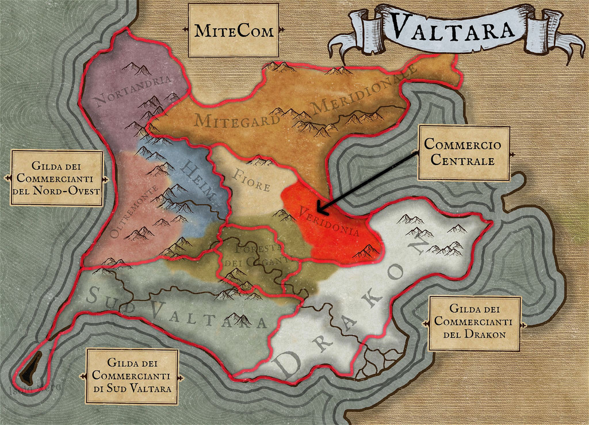

# Federazione delle Gilde dei Commercianti di Valtara

Tags: Organizzazione
Creatore: Lorenzo

# Federazione delle Gilde dei Commercianti di Valtara

---

---

Informazioni Generali

Tipo: Federazione tra Gilde

Struttura: Consorzio

Regione: Valtara

Fondatore: 

Membri: Mercanti di Valtara

Alleati:

Nemesi:

## Descrizione Generale

---

La Federazione delle Gilde dei Commercianti di Valtara ha lo scopo di promuovere la cooperazione tra le diverse gilde regionali, facilitando lo scambio di risorse e creando un ambiente favorevole per lo sviluppo economico e il commercio nella vasta regione di Valtara. La federazione coordina gli sforzi delle gilde per affrontare le sfide comuni e sviluppare strategie collaborative per sostenere l'economia locale e regionale.

## 1. Gilda dei Commercianti del Nord-Ovest

---

Questa gilda gestisce le attività commerciali nelle regioni settentrionali di Valtara, comprese **Nortandria**, **Heim** e **Oltremonte**. Riconosciuta per la sua rete commerciale consolidata, sfrutta le rotte di trasporto e le partnership con l’impero dishartiano per favorire gli scambi commerciali tra Valtara e le regioni estere.

## 2. MiteCom

---

Gilda dei commercianti del **Mitegard Meridionale**. Gran parte delle rotte commerciali marittime nel Mare di Smeraldo sono gestite da questa gilda.

## 3. Commercio Centrale

---

 Concentrandosi sul commercio nelle regioni di **Veridonia** e **Fiore**, questa gilda si distingue per la sua abilità nell'agevolare gli scambi di beni di lusso e prodotti artigianali pregiati. Sfrutta le risorse naturali e i prodotti distintivi di queste regioni per promuovere la loro valorizzazione commerciale.

## 4. Gilda dei Commercianti del Drakon

---

Operante principalmente nella regione del Drakon e, in misura minore, nel regno di Drakonia, questa gilda si specializza nel commercio di risorse naturali, tra cui minerali preziosi e prodotti derivati dalla fauna e dalla flora uniche di queste terre. Sfrutta abilmente le connessioni commerciali con altre regioni al di là del mare […] per facilitare la distribuzione di tali risorse.

## 5. Gilda dei Commercianti di Sud Valtara

Questa gilda è responsabile del commercio nella regione del Sud Valtara, che include una varietà di risorse agricole, manifatturiere e minerarie. La gilda gestisce le rotte commerciali da e verso l’isola di Rotrekia, soddisfando le esigenze dei mercati interni ed esterni.

## Foresta dei Giganti

Anche se la maggior parte della Foresta dei Giganti rimane inesplorata, le gilde si impegnano nel gestire le attività commerciali nelle zone esterne della regione, dove si trovano città importantissime come [Kos](Kos%20bb2884f1df2e4e47890b8cefddb5e4bd.md) . Una rotta commerciale co-gestita dalle gilde circumnaviga il cuore della Foresta dei Giganti, percorrendo tutta la zona esterna, e collegando tra loro ogni rotta commerciale di Valtara.