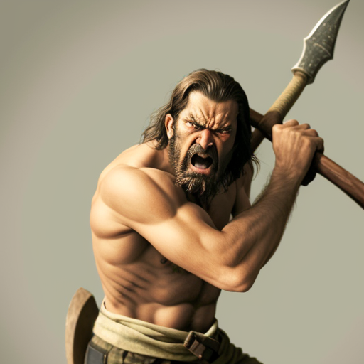

# Grunt Martelcuore

Tags: PC
Creatore: Luca Incutto
Giocatore: Luca Incutto
Luogo: Azura
Razza: Nano
Classe: Barbaro
Livello: 5

# Grunt Martelcuore

---

Informazioni Generali

Età:

Data di nascita:

Luogo di nascita:

Razza: Nano

Classe: Barbaro

Alleati: 

Nemesi:

Alias:

Professione: Protettore

---

## 1. Descrizione Generale

---

Grunt è un nano robusto e massiccio, con mani grosse e callose, testimonianza dei lunghi anni trascorsi a lavorare con materiali grezzi nelle montagne. Indossa abiti robusti e pratici, preferendo pelli e tessuti resistenti per sopportare le dure condizioni del mondo esterno. Sulla schiena porta una ascia bipenne, sua arma preferita.

> “Tu! Dammi altro cibo!”
> 

## 2. Biografia

---

Grunt è nato e cresciuto tra le montagne a sud di Azura, con la tribù dei Martelcuore, un gruppo di nani che ha sempre disdegnato la civiltà. La sua infanzia è stata segnata da giorni trascorsi nelle grotte e nelle valli nascoste tra montagne, imparando a sopravvivere grazie a un profondo legame con la natura circostante. Grunt ha sviluppato una forza brutale che lo ha fatto risaltare tra i suoi simili.

## 3. Carriera

---

Un incontro casuale con un gruppo di avventurieri provenienti dalla Gilda dei Protettori di Azura ha cambiato la vita di Grunt. La sua incredibile abilità nel combattimento e la sua capacità naturale di sopravvivenza lo hanno reso un membro apprezzato della gilda. Grunt ha abbandonato la vita nelle montagne per unirsi alla Gilda dei Protettori di Azura, aprendo così le porte alla scoperta di nuove terre e avventure. Combattendo per la gilda, Grunt ha dimostrato di essere un alleato valoroso, anche se la sua scarsa conoscenza delle città e delle leggi lo porta spesso in situazioni comiche.

## 4. Personalità

Grunt è noto per la sua lealtà e per il suo stomaco senza fondo. La sua natura barbarica si combina con una curiosità ingenua nei confronti della civiltà, portandolo a imparare lentamente le stranezze della vita in città. È un combattente determinato, pronto a proteggere i suoi alleati con la sua forza brutale. La sua semplicità e il suo spirito libero possono portare a momenti di comicità e imbarazzo, ma la sua genuinità lo rende un amico fidato e un compagno di avventura pronto a tutto, soprattutto quando viene ricompensato con un lauto pasto. Grunt è ansioso di esplorare il mondo al di fuori delle montagne e sta appena iniziando la sua avventura.

---

## 5. Coinvolgimenti in Eventi Recenti

---

[Untitled Database](Untitled%20Database%203abb1ead1dea450c8b5bf8e09d4ba432.csv)

## A. Scheda Personaggio

---

[Info PG](Info%20PG%203f8f648f857f45638404a4002935f782.csv)

### Statistiche e abilità

---

[Abilità](Abilita%CC%80%2030656d6a803f4118859cebbb4b9a8b94.csv)

### Lista magie

## B. Galleria Immagini

## A. Descrizione Originale

---