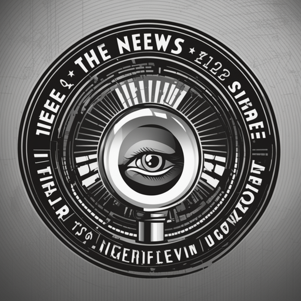

# La Striscia della Notizia

Tags: Organizzazione
Creatore: Davide
Ispirazione: Striscia la notizia
Luogo: Valtara

# La Striscia della Notizia

---

---

Informazioni Generali

Tipo: Associazione

Struttura:

Regione: Valtara

Fondatore: Riccitoni

Membri: Gi Mi 1

Alleati: Gilda dei protettori

Nemesi: Gli sciacalli

## 1. Descrizione Generale

---

*La Striscia della Notizia* è un'organizzazione segreta e altamente specializzata nel campo dello spionaggio e del reperimento di informazioni strategiche. Operante nell'ombra, *La Striscia della Notizia* è dedicata a preservare l'equilibrio del mondo, prevenendo minacce nascoste e garantendo la sicurezza globale.

> “È lui o non è lui? Ceeeerto che è lui” - Tipico saluto degli agenti dell’organizzazione
> 

## 2. Storia

---

L'origine esatta di *La Striscia della Notizia* è avvolta nel mistero e oggetto di speculazioni. La sua fondazione risale a secoli fa, ma le sue attività sono sempre state celate al pubblico. L'organizzazione è nata come risposta a una crescente necessità di raccogliere e proteggere informazioni vitali che potrebbero influenzare il destino del mondo.

Nel corso degli anni, *La Striscia della Notizia* ha sviluppato un'ampia rete di agenti altamente addestrati, provenienti da una varietà di razze e sfondi. Questi agenti operano in modo discreto, spesso sotto falsa identità, per reperire informazioni critiche e prevenire catastrofi imminenti.

## 3. Valori

---

La missione principale di *La Striscia della Notizia* è preservare la pace e l'equilibrio mondiale. L'organizzazione si impegna a identificare e affrontare minacce che potrebbero mettere in pericolo la stabilità delle nazioni e la sicurezza delle persone. Questo include il monitoraggio di organizzazioni criminali, gruppi estremisti, forze sovversive e ogni altra entità che rappresenti una minaccia.

## 4. Organizzazione

---

L'organizzazione è guidata da un consiglio segreto composto dai suoi membri più anziani e saggi. Il consiglio prende decisioni cruciali e stabilisce le priorità delle missioni. Al vertice dell'organizzazione si trova un Leader Supremo, il cui vero nome è noto solo a pochi eletti.

*La Striscia della Notizia* è suddivisa in divisioni specializzate, ognuna delle quali si concentra su una particolare area di competenza. Queste divisioni includono:

1. **Divisione dell'Intelligence**: Responsabile della raccolta e dell'analisi delle informazioni critiche.
2. **Divisione Operativa**: Gli agenti di questa divisione eseguono missioni sul campo, raccogliendo dati direttamente dal luogo degli eventi.
3. **Divisione Tecnologica**: Specializzata in tecnologie avanzate e sorveglianza elettronica.
4. **Divisione Strategica**: Si occupa della pianificazione delle operazioni e della definizione degli obiettivi a lungo termine.

### 4.1 Metodi Operativi

---

*La Striscia della Notizia* opera con il massimo rispetto per la legge e i diritti umani. Le sue attività sono finalizzate a prevenire conflitti e minacce nascoste senza compromettere l'integrità delle nazioni sovrane. Gli agenti dell'organizzazione seguono rigorosi protocolli etici per garantire che le informazioni vengano utilizzate in modo responsabile.

### 4.2 Segretezza e Discrezione

---

La segretezza è una caratteristica distintiva di *La Striscia della Notizia*. Nessuno, tranne i membri dell'organizzazione, conosce la sua esistenza o la portata delle sue operazioni. Questa discrezione è essenziale per proteggere gli agenti e garantire l'efficacia delle missioni.

## 5. Attività

---

Attività svolte