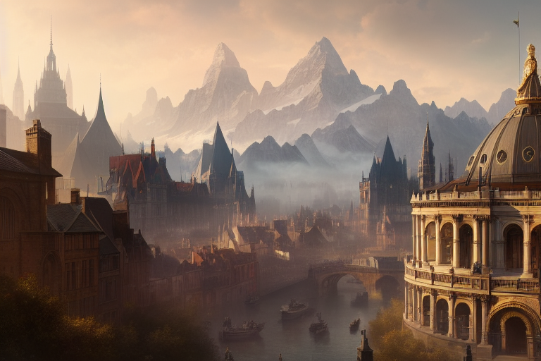

# Pandosia

Tags: Città
Creatore: Lorenzo
Ispirazione: Mendicino

# Pandosia

---

Informazioni Generali

Tipo di Luogo: Città Minore

Dimensioni:

Altitudine: 650 m slm

Popolazione: 17000

Paese: 

Luogo: Valtara

---

## 1. Descrizione Generale

---

Pur non essendo particolarmente grande, riveste un ruolo importante come centro produttivo per la seta e altri tessuti. La sua posizione strategica lungo il corso del fiume Busento e nelle vicinanze della catena montuosa della Sila ne fa un punto di riferimento per il commercio e l'artigianato. La città è conosciuta per la sua vivace atmosfera e per la bellezza dei suoi paesaggi naturali.

## 2. Storia

---

Non si conosce molto sulla storia della città. Probabilmente è sempre stato un centro abitato tranquillo e dedito al commercio, che di rado ha dovuto fare i conti con i numerosi conflitti che hanno interessato la regione. Nonostante questa fortunata condizione, alcuni storici Pandosiani affermano che il noto condottiero Al Riko, che guidò le armate dishartane durante il secolo delle razzie, venne fermato e sconfitto proprio dai Pandosiani. Non solo non ci sono prove che possano confermare questo evento, ma è stato anche ampiamente dimostrato che il condottiero si spinse fino alla città di Kos, ben oltre i confini della città.

## 3. Geografia

---

 Pandosia si estende lungo le sponde del fiume Busento, che fornisce una fonte vitale di acqua e risorse per la città. La sua posizione a ridosso della catena montuosa della Sila le conferisce una vista spettacolare sulle maestose vette e offre opportunità per l'esplorazione e l'avventura. I paesaggi circostanti sono caratterizzati da colline lussureggianti, boschi rigogliosi e prati fertili, creando una cornice naturale incantevole per la città.

## 4. Cultura

---

Pandosia è una città con una ricca cultura, influenzata dalle diverse razze che la compongono. La lavorazione della seta è una delle arti più pregiate, e le botteghe artigiane sono abbondanti nelle strade, con tessitori e sarti che creano capi di abbigliamento pregiati e ricercati. La cucina è un'altra forma d'arte celebrata nella città, con ristoranti e taverne che offrono piatti deliziosi preparati dagli abili chef halfling. La città ospita anche una serie di festival e celebrazioni annuali, inclusa la cerimonia dell'elezione del questore ogni cinque anni, che attira visitatori da tutto il Nord-Ovest.

## 5. Demografia

---

La popolazione di Pandosia è variegata, ma gli abitanti sono principalmente composti da orchi (42%) e halfling (12%). Questa miscela di razze crea una vibrante fusione di culture e tradizioni nella città. Gli orchi, noti per la loro forza e abilità nella produzione di tessuti, hanno portato avanti l'antica tradizione della lavorazione della seta, mentre gli halfling hanno contribuito con la loro abilità culinaria e la loro propensione al commercio.

## 6. Governo

---

Pandosia è governata da un questore, un individuo eletto ogni cinque anni per amministrare la città e risolvere le dispute tra i cittadini. Il questore rappresenta l'autorità centrale e ha il compito di garantire l'ordine e la prosperità all'interno di Pandosia. Le decisioni importanti vengono prese in base al consenso tra i cittadini e i leader delle diverse razze presenti nella città, promuovendo così la cooperazione e la convivenza pacifica tra le diverse comunità. Il Questore di Pandosia è anche uno dei membri del Consiglio della Gilda dei Commercianti del Nord-Ovest.