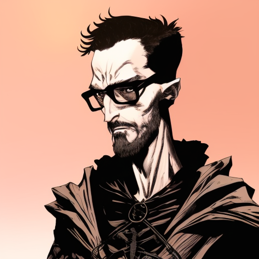

# Sabaku no Darude

Tags: PC
Alias: Il ricercatore della Lore
Creatore: Francesco C.
Giocatore: Francesco Curcio
Ispirazione: Sabaku no Maiku
Luogo: Kos
Razza: Mezz’elfo
Classe: Bardo
Livello: 10

# Sabaku no Darude

---

Informazioni Generali

Età:

Anno di nascita:

Paese di nascita:

Razza: Mezz’elfo

Relazioni:

Alleati:

Nemesi:

Possedimenti importanti:

---

## 1. Descrizione Generale

---

Sabaku no Darude è un mezzelfo nato in una landa desertica del continente. Ha una combinazione di tratti sia umani che elfici, con una pelle leggermente scura e capelli castani mossi. I suoi occhi, di un colore ambrato brillante, riflettono la sua passione interiore.

> “Per chi conosce la Lore. Per chi la sta scoprendo. Per chi la scoprirà” - Sabaku no Darude
> 

## 2. Biografia

---

Sabaku no Darude è cresciuto in una landa desertica dopo la morte dei suoi genitori mercenari quando aveva solo 5 anni. Ha vissuto con il suo saggio nonno materno, un elfo che gli ha trasmesso l'amore per la musica e l'arte. Grazie alle storie epiche e alle ballate antiche che ha ascoltato, Darude ha sviluppato un profondo desiderio di condividerle con tutte le razze del mondo.

## 3. Carriera

---

Per realizzare il suo desiderio di diffondere conoscenza e creare un legame tra le persone, Darude ha intrapreso un viaggio come bardo itinerante. Durante i suoi viaggi, esplora nuovi luoghi, impara le storie locali e interagisce con le diverse culture e razze. Durante queste esperienze, scrive di sé stesso e degli avvenimenti che gli accadono intorno, creando un diario di viaggio personale.

Darude si esibisce in vari luoghi, dalle taverne dei villaggi alle corti dei re, utilizzando la sua abilità musicale e le sue doti di narratore per coinvolgere il pubblico. La sua musica tocca le corde dell'anima e le sue storie ispirano gli ascoltatori a guardare al di là delle differenze e a trovare un terreno comune.

## 4. Personalità

---

Darude è una persona gentile e appassionata, con una grande curiosità e apertura mentale. È rispettoso delle tradizioni locali e cerca sempre di creare comprensione reciproca tra le diverse razze. La sua passione per la musica e le storie è contagiosa e porta gioia ovunque vada. Ha un'anima creativa e un cuore generoso, e cerca di utilizzare le sue abilità per rendere il mondo un posto migliore.

## 5. Coinvolgimenti in eventi recenti

---

[Untitled Database](Untitled%20Database%2010a4f1e9c7344928a299d9fa00635f6b.csv)

## 6. Scheda personaggio

---

[Info PG](Info%20PG%200f2322afab24429cb360f81d9f366fbc.csv)

### Statistiche e abilità

---

[Abilità](Abilita%CC%80%207e175feb71844b54a1761ee14807b872.csv)

### Lista magie

## A. Descrizione originale

---

Sabaku no Darude è un mezzelfo nato in una landa desertica del continente. I suoi genitori, una madre elfa e un padre umano, erano mercenari del deserto, ma sono morti quando lui aveva solo 5 anni, lasciandolo con pochi ricordi di loro.
È stato cresciuto dal suo saggio nonno materno, un elfo che gli ha trasmesso l'amore per la musica e l'arte. Ha ascoltato le storie epiche e le ballate antiche del continente, imparando le tradizioni e la saggezza elfica.
Le storie raccontate dal nonno (vissuto oltre 400 anni) hanno suscitato in Darude il desiderio di condividerle con tutte le razze presenti nel mondo. Così, ha intrapreso un viaggio come bardo itinerante per esplorare nuovi luoghi, imparare le loro storie e raccontarle.
Durante i suoi viaggi, Darude si impegna a conoscere diverse culture, interagire con le diverse razze e preservare le tradizioni locali. Scrive anche di sé stesso e degli avvenimenti che gli accadono intorno, creando un diario di viaggio personale.
La sua passione è diffondere la conoscenza e creare un legame tra le persone attraverso la musica e le storie che racconta. Spera di ispirare gli altri, creare comprensione reciproca e portare gioia ovunque vada.