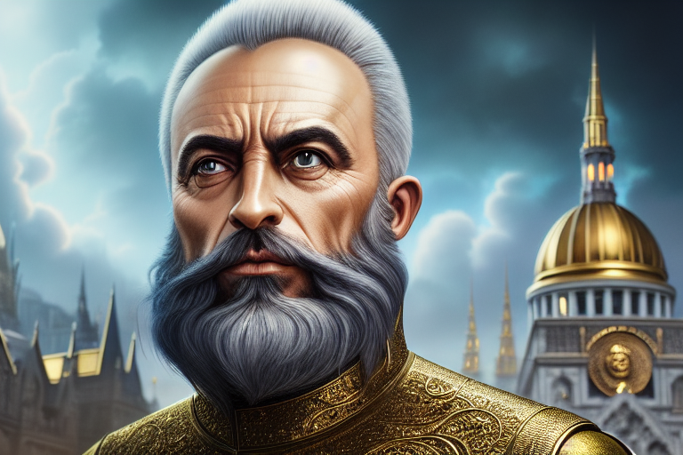

# San Nikolos Dibar

Tags: Personaggio Leggendario
Creatore: Lorenzo
Ispirazione: San Nicola di Bari

# Nikolos Dibar

---

Informazioni Generali

Età: 65

Anno di nascita: 1347-1412

Paese di nascita: Pandosia

Razza: Umano

Relazioni: San venerato a Pandosia e nella regione occidentale di Valtara

Alleati:

Nemesi:

Possedimenti importanti:

---

## 1. Descrizione Generale

---

Nikolos Dibar è una figura leggendaria e venerata nella città di Pandosia per la sua straordinaria vita da avventuriero e la sua generosità verso gli orfani e i meno fortunati. Il titolo "San" attribuito a Nicolos Dibar riconosce il suo impatto eccezionale sulla comunità e il suo status quasi mitico.

> “I panittiaddri i San Nicolos” - filastrocca popolare
> 

## 2. Biografia

---

Nikolos Dibar nacque in una modesta casa rurale nelle campagne di [Pandosia](Pandosia%2028129d9d5ac7448d98387dc4262c4704.md)  nell'anno 1347. Fin dalla giovane età, dimostrò un talento eccezionale per le arti magiche e il combattimento. All'età di 16 anni, intraprese la sua vita da avventuriero, dopo aver difeso un villaggio vicino da una banda di briganti.

Da quel momento, Nikolos divenne noto come un potente stregone guerriero, unendo le arti magiche e la forza fisica in modo unico. Le sue avventure lo portarono in terre remote e misteriose, anche al di fuori di Valtara. Dopo ogni avventura, che poteva durare anche diversi mesi, Nikolos faceva ritorno alla sua città natale, dove donava i grandi tesori trovati ai suoi concittadini. 

Nikolos Dibar visse una vita lunga e avventurosa, ma alla fine si ritirò dalla vita da avventuriero e si stabilì a Pandosia. Morì in pace nella sua casa nel 1412, all'età di 65 anni, circondato dall'amore e dalla gratitudine della comunità che aveva aiutato e ispirato per tutta la vita.

La sua eredità continua a vivere attraverso i templi, i monumenti e le celebrazioni in suo onore a Pandosia. Nikolos Dibar è ricordato come un simbolo di altruismo e determinazione, un esempio di come una singola persona possa cambiare il destino di molti attraverso la gentilezza e l'azione coraggiosa. La sua vita e il suo impatto rimarranno una parte indelebile della storia di Pandosia e continueranno a ispirare le generazioni future.

## 3. Carriera

---

Le storie di Nikolos Dibar narrano di un avventuriero coraggioso e potente che univa le arti magiche e la forza fisica in modo straordinario. Era conosciuto come un potente stregone guerriero e queste sono alcune delle sue avventure più celebri:

**1. La Caccia al Drago d'Ebano**: Nikolos Dibar divenne famoso per aver affrontato un terribile Drago d'Ebano. La bestia oscura aveva terrorizzato i villaggi circostanti per generazioni. Nikolos, con la sua magia e la sua abilità nella spada, sfidò il drago in un combattimento epico che durò 2 giorni, alla fine dei quali lo sconfisse grazie al suo incredibile coraggio.

**2. La Ricerca del Calice di Smeraldo**: Nikolos intraprese un'ardua ricerca attraverso la foresta dei Giganti per trovare il mitico Calice di Smeraldo, un artefatto antico di potere inestimabile. Attraversando insidie come trappole mortali e spiriti viziati, Nikolos alla fine recuperò il calice e lo donò alla città di Pandosia, portando prosperità e pace.

## 4. Personalità

---

Nikolos Dibar era una figura straordinaria, non solo per le sue abilità magiche e il suo coraggio in battaglia, ma soprattutto per la sua personalità altruista e generosa. Credeva fermamente che donare agli altri non solo fosse un atto di compassione, ma che elevasse anche il suo spirito, permettendogli di condividere le gioie delle sue avventure con gli altri. Era un uomo di cuore gentile, la cui umiltà era sorprendente considerando le sue imprese eroiche. Nikolos aveva un'aura di calma e compassione che attirava le persone verso di lui, e spesso si metteva in pericolo per aiutare chiunque fosse in difficoltà. La sua dedizione alla causa dei meno fortunati e il suo desiderio di diffondere la speranza erano contagiosi, ispirando coloro che lo conoscevano a compiere atti di gentilezza simili. La sua personalità luminosa e la sua convinzione profonda nell'importanza di condividere la propria fortuna e le proprie avventure con gli altri sono rimaste parte indelebile della sua leggenda a Pandosia.

## 5. Coinvolgimenti in eventi recenti

---

[Untitled Database](Untitled%20Database%209a5498962e7a40fc8064d94e70ceaf1c.csv)

## 6. Scheda personaggio

---

[Info PG](Info%20PG%2009adae9699d34141ab440aa1617355d5.csv)

### Statistiche e abilità

---

[Abilità](Abilita%CC%80%20f490e2858acb4949aa11fe388d4f8d75.csv)

### Lista magie

## A. Descrizione originale

---