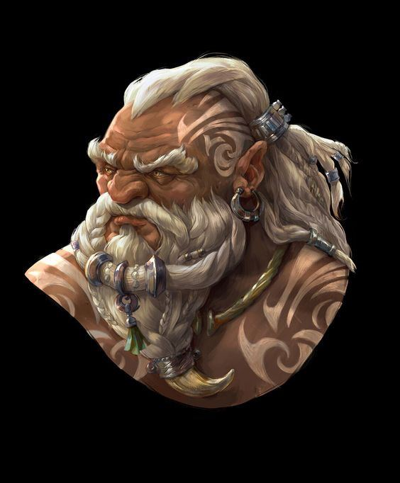

# Stalag Might

Tags: PC
Alias: Il bambino delle rocce
Creatore: Francesco Curcio
Giocatore: Francesco Curcio
Luogo: Bellavalle
Razza: Nano
Classe: Druido

# Stalag Might

---

Informazioni Generali

Età:

Data di nascita:

Luogo di nascita: Lunacrest

Razza: Nano

Classe: Druido

Alleati:

Nemesi:

Alias:

Professione: Il bambino delle rocce

---

## 1. Descrizione Generale

---

Stalag Might è un nano druido le cui origini sono radicate nelle profondità di una montagna antica conosciuta come "Lunacrest". La sua storia è intrecciata con il mistero di questa montagna, dove le energie dell'antica luna scorrono nelle vene stesse della terra. Conosciuto tra i druidi come il "Bambino delle Rocce", Stalag ha sempre mostrato una connessione innata con le pietre e una passione per la geologia.

> “Bella questa roccia”
> 

## 2. Biografia

---

### 2.1 Infanzia

---

Stalag Might nacque nelle viscere di Lunacrest, portando con sé una strana formazione rocciosa sulla mano sinistra, simile alle maestose montagne circostanti. Questo segno innato attirò l'attenzione dei suoi genitori, che lo condussero alla congrega dei druidi del Circolo della Luna quando era ancora un neonato. Il giovane nano cresceva, diventando noto tra i druidi come il "Bambino delle Rocce". La sua forza fisica e la sua passione per la geologia lo resero un apprendista straordinario.

### 2.2 Adolescenza

---

Durante gli anni della sua formazione, Stalag sviluppò un profondo interesse per la metamorfosi, una delle abilità centrali dei druidi del Circolo della Luna. A differenza dei suoi compagni, prediligeva trasformarsi in piccoli animali, come topi, talpe e lucertole, per esplorare fessure e cavità inaccessibili. Questa abilità gli consentiva di scoprire gemme nascoste e segreti geologici, e raccontava avventure vissute attraverso gli occhi di un piccolo animale.

### 2.3 Età Adulta

---

Durnan Crystalbeard, il suo anziano maestro druido, riconoscendo il talento e la dedizione di Stalag, gli regalò un geode speciale quando il giovane nano compì sedici anni. Questo geode, inciso con simboli druidici, divenne sia un focus per la sua magia che un santuario per campioni di rocce e minerali rari. Dopo aver completato la sua formazione con la congrega, Stalag sentì il richiamo dell'esplorazione e del desiderio di scoprire montagne e formazioni rocciose leggendarie, alla ricerca in particolare della pietra leggendaria nota come "Il Cuore della Luna".

## 3. Personalità

---

Stalag Might è noto per la sua mente curiosa e la passione incrollabile per la geologia. È un individuo tranquillo ma osservatore, sempre desideroso di ascoltare le storie delle pietre e dei minerali che incontra lungo il suo cammino. La sua connessione con la natura e il mondo sotterraneo lo rende rispettoso nei confronti dell'ambiente circostante.

Inoltre, la sua abilità unica di trasformarsi in creature più piccole gli conferisce una prospettiva unica sulla vita e sull'esplorazione. Stalag è affezionato ai suoi compagni druidi e considera ogni avventura come un'opportunità per arricchire la sua comprensione delle meraviglie naturali del mondo.

Stalag Might è guidato da una doppia missione: la sete di conoscenza geologica e la ricerca dell'enigmatica "Pietra della Luna". Questo equilibrio tra scienza e magia guida le sue azioni mentre viaggia attraverso il mondo, pronta a esplorare e a svelare i segreti che attendono sotto le rocce e nelle profondità della terra.

## 4. Coinvolgimenti in Eventi Recenti

---

[Untitled Database](Untitled%20Database%20da6a05127a584f75a0bd57df6960b00a.csv)

## A. Scheda Personaggio

---

[Info PG](Info%20PG%20c1cdb90ff3db4272965138ed0c53ac6e.csv)

### Statistiche e abilità

---

[Abilità](Abilita%CC%80%201e7ce6964e984b8d87837edf5c158b9c.csv)

### Lista magie

## B. Galleria Immagini

## C. Descrizione Originale

---

Stalag Mite nacque nelle profondità di una montagna antica, il cui cuore pulsante era un rifugio segreto, scolpito nel tempo dai druidi del Circolo della Luna. La montagna era chiamata "Lunacrest", e si diceva che le sue vene fossero piene delle energie dell'antica luna.
Fin dalla sua nascita, Stalag mostrò una connessione innata con le rocce che lo circondavano. La sua famiglia lo portò alla congrega dei druidi, tutti nani come lui, quando era solo un neonato. Il motivo? Una particolare increspatura sulla sua mano sinistra, una formazione rocciosa in miniatura che assomigliava stranamente alle montagne che circondavano Lunacrest.
Man mano che Stalag cresceva, divenne noto tra i druidi come il "Bambino delle Rocce". La sua forza, acquisita sollevando rocce e aiutando nelle costruzioni all'interno della montagna, lo rese uno degli studenti più fisicamente imponenti della sua età. Tuttavia, la sua passione risiedeva nella geologia. Le rocce, i minerali, i cristalli: tutto aveva una storia da raccontare, e Stalag voleva ascoltarle tutte.
Durante i suoi studi, Stalag scopriì un amore particolare per la metamorfosi, una delle abilità cardine dei druidi del Circolo della Luna. A differenza di molti dei suoi compagni druidi che preferivano trasformarsi in creature grandi e potenti, Stalag aveva una predilezione per piccoli animali: topi, talpe, lucertole e altri creature in grado di infiltrarsi in crepe e cavità. Questa abilità gli permise di esplorare profondità inaccessibili, scoprendo gemme nascoste e segreti geologici. Era noto per raccontare storie di avventure vissute da un piccolo topo o di passaggi segreti trovati sotto forma di lucertola.
Il suo maestro, un anziano druido chiamato Durnan Crystalbeard, gli regalò un geode speciale quando Stalag compì sedici anni. Questo geode, decorato con incisioni druidiche, non solo fungeva da focus per la sua magia, ma conteneva anche un piccolo spazio all'interno, in cui Stalag conservava campioni di rocce e minerali rari.
Dopo aver completato la sua formazione con la congrega, Stalag decise di esplorare il mondo. Voleva vedere e studiare formazioni rocciose e montagne che la sua congrega aveva solo menzionato nelle leggende. Ma oltre alla sua sete di conoscenza, Stalag aveva anche un secondo obiettivo: trovare una pietra leggendaria chiamata "Il Cuore della Luna". Si diceva che questa pietra contenesse il potere della luna stessa e avrebbe potuto aumentare enormemente i poteri di un druido del Circolo della Luna.

---

Nelle profondità di Lunacrest, il Circolo dei Druidi del Diamante Lunare ha eretto il suo santuario. Questo circolo è composto principalmente da nani, che vedono la luna come il massimo esempio di bellezza e forza rocciosa. La luna, per loro, è la roccia madre, la pietra guida che illumina il cielo notturno e dona forza e protezione al mondo sottostante.
Il santuario stesso è un capolavoro di architettura e geologia. Le pareti e i soffitti sono scolpiti in forme che raffigurano le fasi della luna e le sue influenze sulle rocce e sui minerali della terra. In alcune camere, cristalli luminosi sono incastonati nel soffitto, riflettendo la luce in modo da creare l'illusione di un cielo stellato. Al centro del santuario c'è un grande altare circolare fatto di una roccia che assomiglia al marmo lunare. Qui, durante le notti di luna piena, i druidi si radunano per celebrare riti sacri e cantare inni in onore della luna.
Il circolo insegna che ogni roccia e minerale ha un legame spirituale con la luna. Credono che la luna influenzi la formazione delle rocce, il loro aspetto e le loro proprietà magiche. Inoltre, ritengono che ogni druido possa attingere a questo legame ancestrale attraverso la meditazione e le pratiche druidiche.
La formazione di un druido nel Circolo del Diamante Lunare non riguarda solo la magia e la natura, ma anche la geologia. Si impara a leggere le rocce, a comprenderne la storia e a utilizzare le loro energie in sinergia con la magia druidica. Ogni druido è anche un geologo esperto, capace di identificare minerali, predire terremoti e comprendere le meraviglie nascoste sotto la superficie della terra.
Stalag Mite, come tutti gli altri druidi del circolo, ha trascorso anni ad affinare le sue abilità geologiche e a comprendere il profondo legame tra le rocce e la luna. Questa connessione lo ha aiutato a sintonizzarsi con la natura in modi che altri druidi possono solo sognare, rendendolo uno dei membri più rispettati del suo circolo nonostante la sua giovane età.