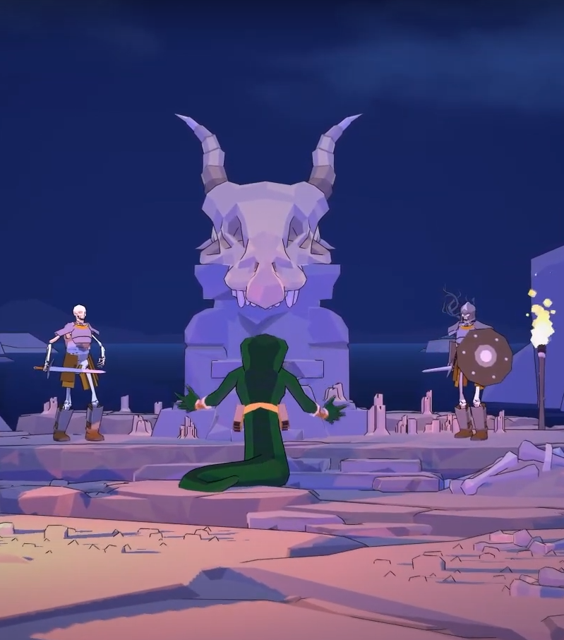
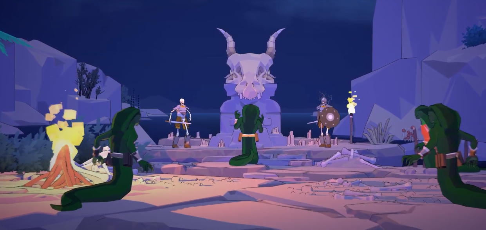

# [TEMPLATE EVENTO STORICO]

# [Evento Storico]

---

Informazioni Generali

Tipo: 

Data:

Durata:

Luogo:

Partecipanti:

Risultati:

---

---

## 1. Descrizione Generale

---

[Historical event] was a [type of event] that involved [organization], lead by [character].

> Quote about [historical event]
> 

## 2. Background Storico

---

[Historical event] was a [type of event] that occurred in [location] around [time]. A [type of organization] called [name of organization] embarked on a campaign supported by [larger organization]. Their goal was to [objective]. This culminated in [preceding event] leading to [this event].

## 3. Aftermath & Conseguenze a Lungo Termine

---

## 4. [Evento Storico] Nel Mito e nel Folklore

---

## 5. Player Predispositions / Archetypes:

---

[Event] will definitely remind player of [thing player is familiar with—e.g. American Civil War, Bubonic Plague, the Mongol invasion]