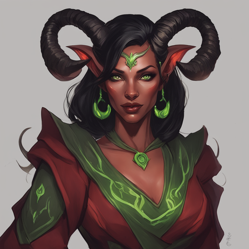

# Arietta Berti

Tags: PC
Creatore: Alessio
Giocatore: Alessio
Ispirazione: Orietta berti
Luogo: Kos
Razza: Tiefling
Classe: Mago
Livello: 1

# Arietta Berti

---

Informazioni Generali

Età: 40 

Data di nascita: 01/06/1983

Luogo di nascita:

Razza: Tiefling

Classe: Maga

Alleati:

Nemesi:

Alias:

Professione: 

---

## 1. Descrizione Generale

---

Arietta Berti è una Tiefling dal passato segnato da scherni e discriminazione. Nata in una piccola comunità umana, ha vissuto fin dall'infanzia l'isolamento e la paura degli altri a causa delle sue origini demoniache. I suoi corni, la pelle scura e i tratti demoniaci facevano di lei un oggetto di sospetto e pregiudizio.

## 2. Biografia

---

### 2.1 **Infanzia e Giovinezza**

Durante l'infanzia, Arietta fu costretta a nascondere la sua natura e a sopprimere il suo potenziale magico per evitare l'ostilità degli altri bambini. Questi primi anni furono un periodo di solitudine e auto-rinuncia, ma anche di scoperta segreta dei suoi poteri innati. La magia scorreva nelle sue vene, e mentre cresceva, iniziò a coltivare il suo talento segreto, studiando incantesimi in silenzio nelle notti oscure.

### 2.2 **La Fuga e la Ricerca della Conoscenza**

All'età di sedici anni, Arietta decise di fuggire dalla comunità che l'aveva sempre respinta. Senza guardare indietro, si mise in viaggio per cercare una nuova vita, desiderando ardentemente di superare le barriere che le avevano negato la sua piena espressione come maga tiefling. Durante i suoi vagabondaggi, incontrò un vecchio mago che riconobbe il suo potenziale magico e le insegnò l'arte della magia con amore e accettazione.

### 2.3 **La Creazione di una Nuova Scuola di Magia**

Dopo anni di studio e pratica, Arietta Berti sviluppò una visione ambiziosa: creare una nuova scuola di magia aperta a tutti, indipendentemente dalla loro razza o origine. Sognava un luogo in cui i maghi tiefling come lei, così come tutte le altre razze, potessero studiare e perfezionare le loro abilità senza temere il pregiudizio.

### 2.4 **Determinazione e Ambizione**

Arietta è diventata una maga di straordinario talento e determinazione. Nonostante le difficoltà e gli ostacoli lungo il suo cammino, ha continuato a perseguire il suo obiettivo con passione. È disposta a tutto pur di raggiungere la sua missione e aprire le porte della conoscenza magica a chiunque desideri imparare.

## 3. Carriera

---

La carriera di Arietta Berti è stata una strada di crescita e apprendimento costante. Dopo aver abbracciato la magia come strumento di cambiamento, ha iniziato la sua ricerca per creare una nuova scuola di magia inclusiva. Tuttavia, per acquisire esperienza e competenza, ha scelto di unirsi alla gilda dei Protettori della Sila e dei Lupi.

All'interno della gilda, Arietta ha affinato le sue abilità magiche, ma ha anche imparato il valore della collaborazione e della protezione delle comunità. Ha partecipato a missioni di difesa e ha aiutato a mantenere la pace nella regione di Valtara. Quest'esperienza ha arricchito la sua comprensione del mondo e delle sue sfide, fornendole una prospettiva più ampia sulla magia e sulla società.

## 4. Personalità

---

Arietta Berti è conosciuta per la sua determinazione inarrestabile e la sua ambizione straordinaria. È empatica e aperta, promuovendo l'accettazione delle differenze. La sua mente brillante e la sua sensibilità artistica la rendono un'intellettuale curiosa e creativa.

## 5. Coinvolgimenti in Eventi Recenti

---

[Untitled Database](Untitled%20Database%20754f52a89d644d8ca010c7a6e6a0ab2d.csv)

## A. Scheda Personaggio

---

[Info PG](Info%20PG%20f9257877918c439f8332081b5e2452c2.csv)

### Statistiche e abilità

---

[Abilità](Abilita%CC%80%2001d18c05f5194fafac229faf5a23bbc2.csv)

### Lista magie

## B. Galleria Immagini

## A. Descrizione Originale

---