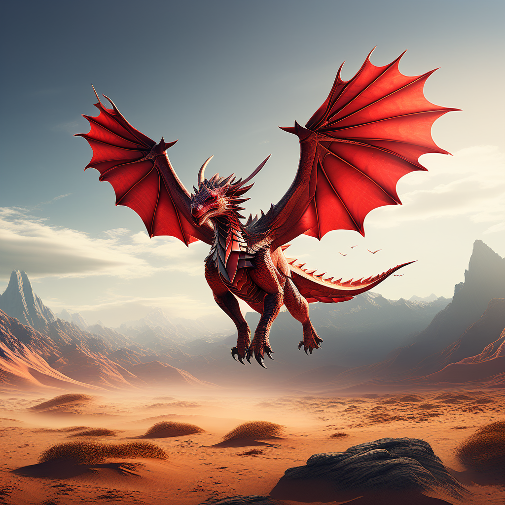
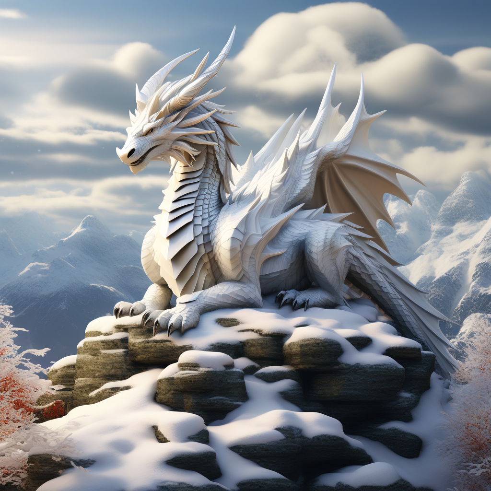
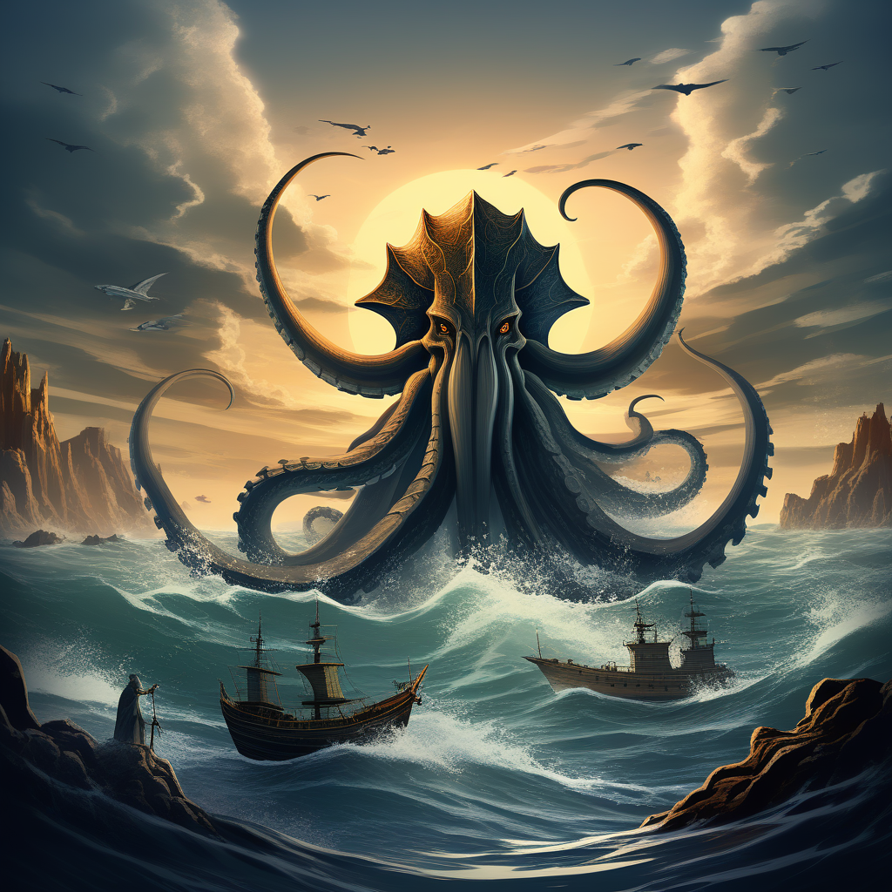
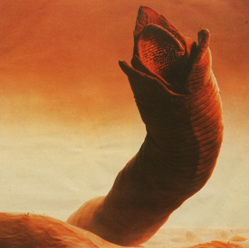
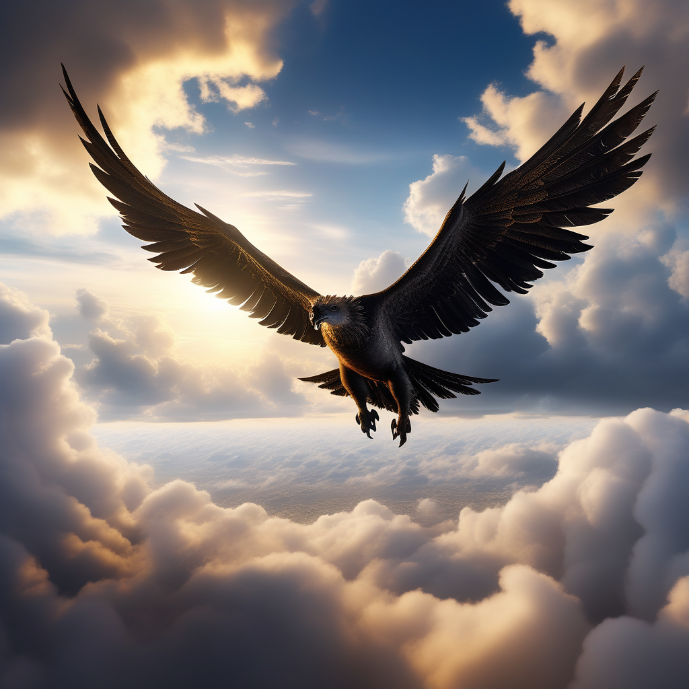
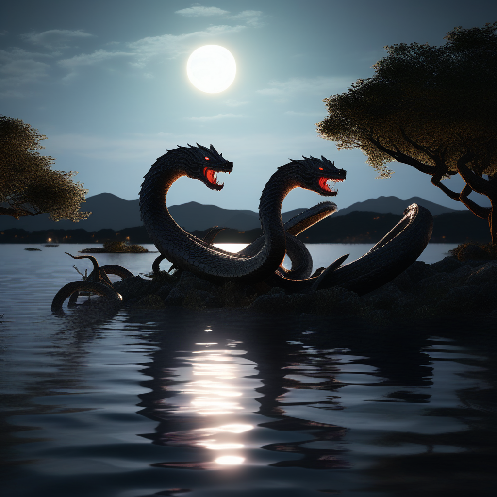
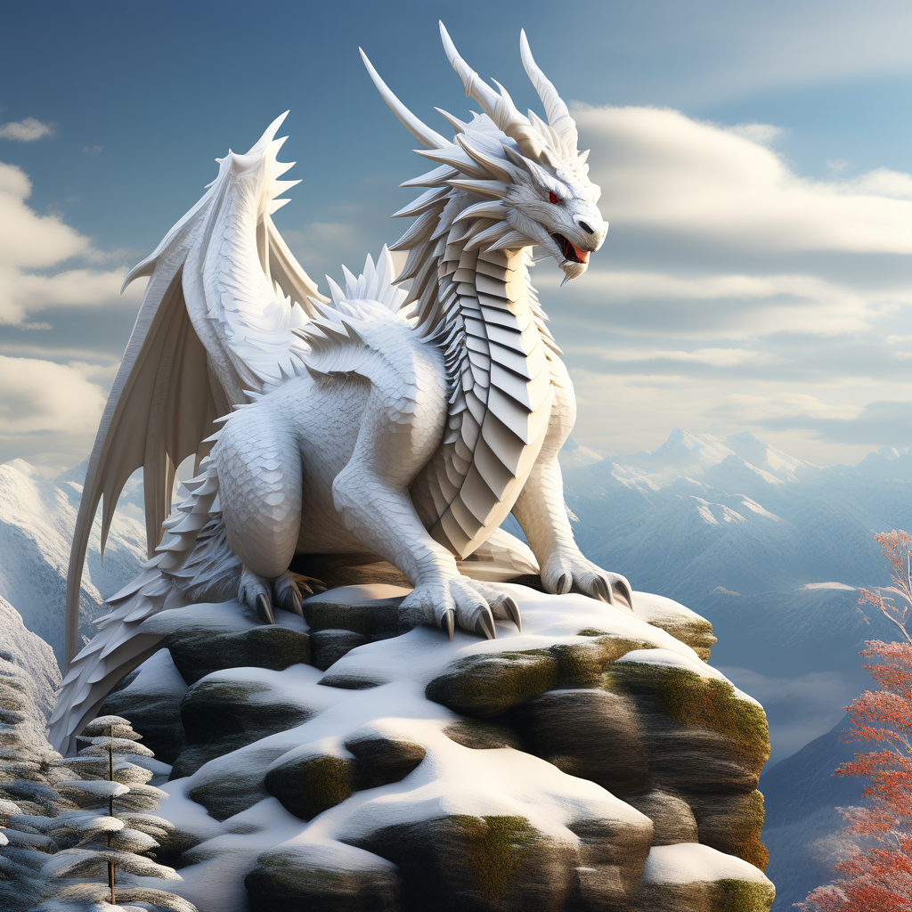
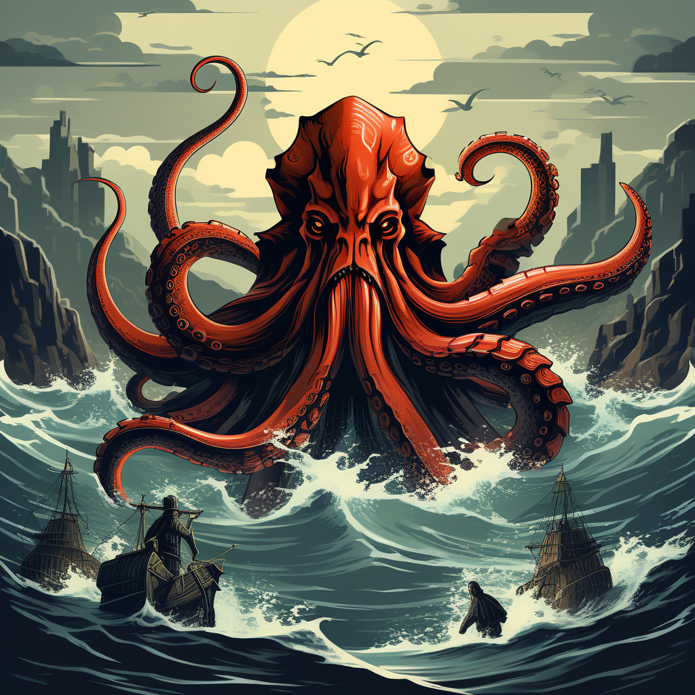
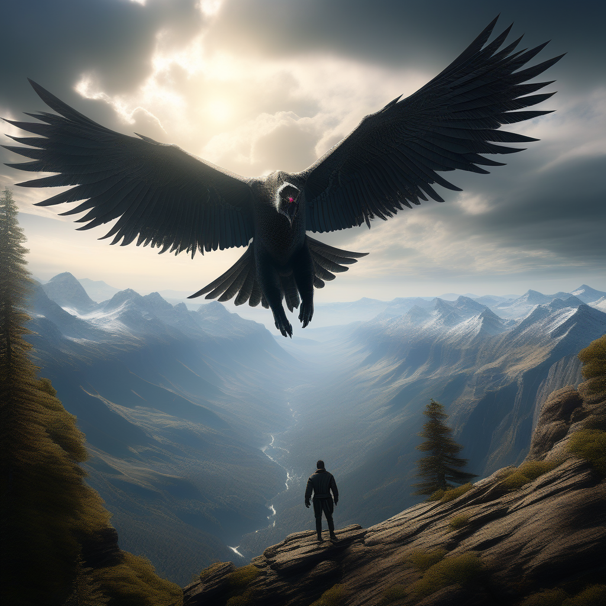
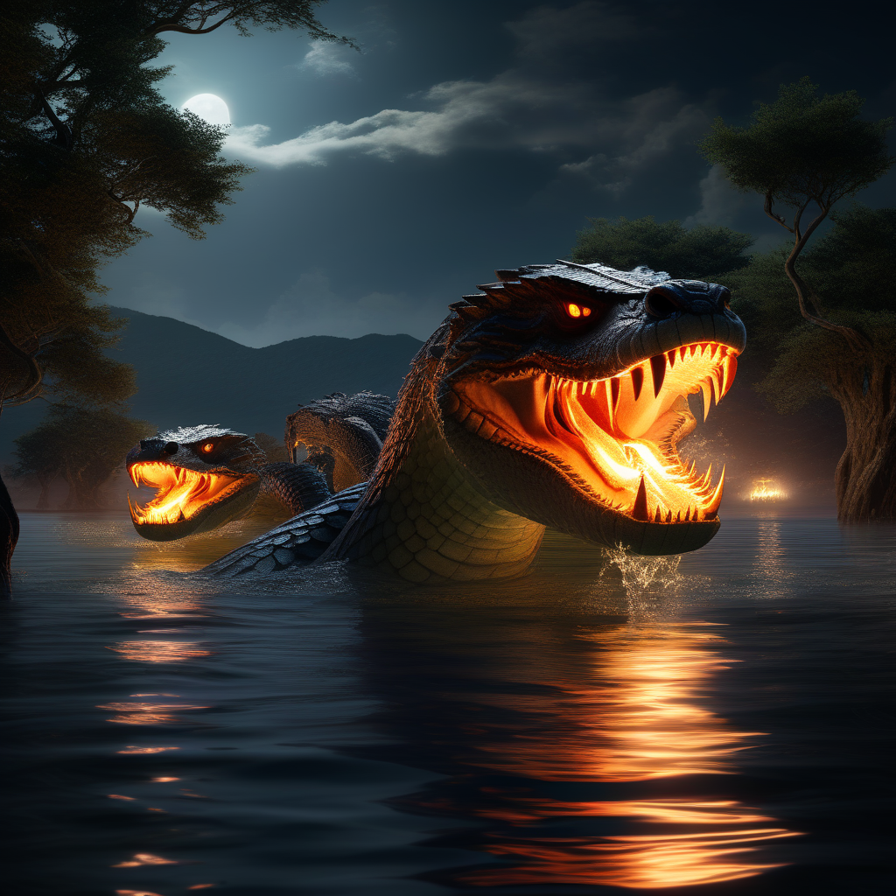

# Bestiario delle Ere Primordiali

> Nel crepuscolo dei tempi, quando Astarte era un mosaico di poteri divini e la creazione danzava sulla soglia dell'eternità, nacquero creature destinate a incarnare la magnificenza primordiale. Questo Bestiario delle Ere Primordiali è un monumento eretto dalla perseveranza di decenni di pellegrinaggi, una testimonianza di ciò che fu un tempo e di ciò che ancora persiste nell'eco delle leggende.
Questo Bestiario delle Ere Primordiali è il frutto di decenni di pellegrinaggi attraverso terre remote, un'epopea di conoscenza raccolta ascoltando antiche leggende e recuperando informazioni ormai perdute nei meandri del tempo.
Qui, tra le pagine di questo tomo, si svelano le immagini delle bestie ancestrali che un tempo solcavano i cieli di Astarte, calpestavano le sue terre selvagge e dominavano gli abissi del suo regno marino. Ogni creatura narrata in queste pagine è un frammento del passato primordiale, una testimonianza vivente delle forze che plasmarono il mondo nei suoi albori.
Nel corso di innumerevoli pellegrinaggi attraverso montagne antiche, foreste impenetrabili e deserti eterni, gli studiosi hanno ascoltato le voci del passato che sussurrano ancora nel vento. Le leggende tramandate da generazioni hanno trovato rifugio in queste pagine, creando un ricamo di verità e mito intrecciato con maestria.
Ogni descrizione è un rituale di evocazione delle creature primordiali, una chiamata ai tempi in cui gli dèi stessi intessero la trama della creazione. Che tu sia un viandante curioso o uno studioso desideroso di scrutare gli archivi dell'antichità, il Bestiario delle Ere Primordiali è la tua chiave per penetrare il velo del passato e immergerti nelle storie delle creature che un tempo furono padrone indiscusso di Astarte. Che questa opera ti guidi attraverso le epoche, portandoti più vicino a comprendere l'essenza stessa delle Ere Primordiali.
- Fra’ Antonius Rixi
> 

## Drago Rosso

Il drago rosso, incarnazione del fuoco, si erge con imponente maestosità. La sua corazza di scaglie rosse, simili a lingue di fiamma, riflette l'intensa forza che lo abita. Le ali membranose, sostenute da ossa dorate, brillano con una luce arancione dorata. Gli occhi infuocati sfoggiano astuzia e saggezza ancestrali. Il ruggito, un tuono di fuoco, segna la sua supremazia. Le zampe artigliate e possenti, come uncini ardenti, testimoniano la sua regalità tra i draghi. Una creatura magnifica e spaventosa, il drago rosso incarna la potenza distruttiva del fuoco.

## Drago Bianco

Il drago bianco, sovrano delle regioni glaciali, si presenta con eleganza maestosa. La sua pelle di scaglie ghiacciate, bianca come la neve, brilla sotto la luce lunare. Le ali membranose, attraversate da venature bluastre, sembrano dipinte dall'inverno eterno. Gli occhi azzurri, freddi come il ghiaccio, rivelano una ferma intelligenza. Il suo ruggito, un vento gelido, echeggia tra le vette montuose. Le zampe possenti, artigliate come ghiacci affilati, attestano la sua regalità tra i draghi. Il drago bianco incarna la potenza glaciale, una creatura sublime e temibile.

## Kraken

Il Kraken, terrore degli abissi, è una creatura marina leggendaria di proporzioni gigantesche. La sua massa oscura e squamosa si staglia contro il cielo d'azzurro, mentre tentacoli corazzati e sottili si estendono dalla superficie dell'acqua, pronti a trattenere e affondare qualsiasi nave sventurata che attraversi il suo territorio. Gli occhi enormi e luminescenti fissano gli intrusi con un'intelligenza antica, emanando una luce blu profonda. La sua presenza è accompagnata da un'aura di potere, facendo sì che il mare stesso si ritiri timoroso di fronte a questa creatura colossale.

## Sandworm

Il Verme del Deserto, colosso delle dune, si insinua nell'aridità con maestosità spietata. La sua pelle squamosa, dai toni del deserto, si camuffa con l'ambiente sabbioso. Mascelle possenti, punteggiate di denti affilati, svelano la sua natura predatrice. Gli occhi, brillanti di una luce dorata, scrutano l'orizzonte mentre emerge dalla sabbia. Dotato di agilità sorprendente sotto terra, il Verme del Deserto colpisce con attacchi fulminei, catturando chiunque sfidi il suo dominio. La sua coda, come un tornado di sabbia, è un'arma temibile. Il Verme del Deserto, narrato tra i viaggiatori, è il terrore delle terre brucianti.

## Besugus

Il Besugus, creatura delle oscure foreste, si cela nell'ombra con la sua pelle rossa sanguigna e la testa mostruosa. Dotato di occhi sinistri e un sorriso distorto, Besugus caccia in branco con un ghignante richiamo di besugi e un ululato inquietante. Le sue zampe artigliate e snodabili muovono l'animale con una sinistra agilità, mentre il suo habitat, un luogo di risate irreali e grida spettrali, diventa il teatro di cacciatori notturni. Nelle tenebre delle sue foreste, Besugus incute timore, un orrore incarnato dalle sue movenze e dal suo sguardo famelico.

## Roc

Il Roc, signore etereo dei cieli, spande le ali tese come un mantello d'azzurro tempestoso. Il suo piumaggio, sfumato di blu e argento, evoca l'iridescenza di un cielo stellato. Con l'apertura alare che oscura il firmamento, il Roc plana, imponente e regale. Il becco affilato come una lama traccia linee imperiose nell'aria, mentre gli occhi scrutano il mondo dall'alto. Zampe possenti, artigli come fulmini, testimoniano il dominio incontrastato del Roc nei cieli. Nella mitologia, il suo volo è un'ode al divino, un'epopea silenziosa di forza e maestosità che pervade i reami celesti.

## Idra

L'Idra, serpente delle acque oscure, incute terrore con la sua molteplicità. Le scaglie risplendono sotto la luce lunare, svelando un corpo snodato che si insinua sinistramente attraverso fiumi e stagni. Le teste, numerose e sempre rinnovate, si ergono su colli serpentini, occhi che bramano la preda con ossessione. Le fauci gocciolanti, imbevute di veleno, sibillano morte mentre l'Idra cattura ogni cosa nel suo raggio d'azione. Code serpeggianti radicate nelle profondità fungono da tentacoli insidiosi. L'Idra, incarnazione del caos, risorge con potenza maggiore ad ogni scontro, una minaccia che emerge dall'oscurità delle acque.

## Galleria Immagini

Drago Bianco

Drago Bianco

Drago Rosso

Kraken

Kraken

Roc

Idra