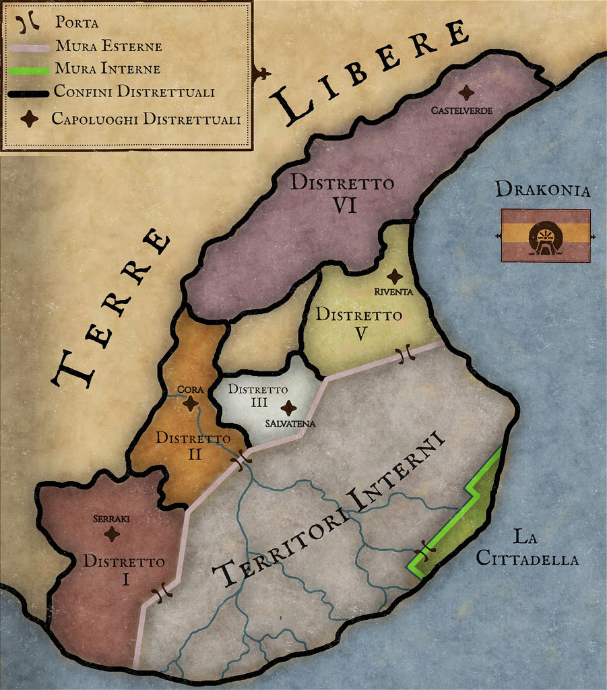
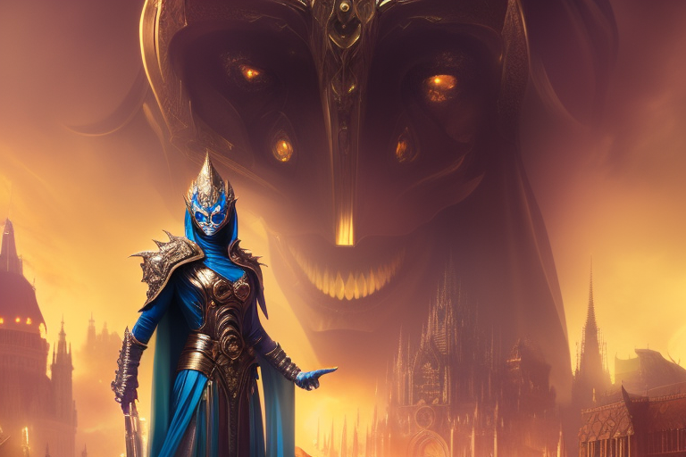

# Drakonia

Tags: Stato
Creatore: Lorenzo

# Drakonia

---

.png)

Informazioni Generali

Nome Ufficiale: Drakonia

Lingue Ufficiali: Comune Valtarese

Capitale: La Cittadella

Forma di Governo: Dittatura Totalitaria

Popolazione: N.A.

Superficie: 

Continente: Valtara

Alleati: 

---

## 1. Descrizione Generale

---

Drakonia è un regno cupo e misterioso, situato sul delta del fiume Kratos lungo la costa. La sua imponente capitale, la cittadella, è circondata da alte mura impenetrabili. La popolazione vive sotto il controllo assoluto del Re Oscuro. Il governo è totalitario.

## 2. Storia

---

Nell'anno 1032, Draco Valerian, era il delfino della nobile casata reale del Drakodor. Tuttavia, quel periodo rimane impresso nella memoria collettiva come l'anno della Piaga, un evento climatico devastante che gettò le fertili terre di Valtara nell'abisso della crisi. Le colture languirono, le malattie mietevano vite e le autorità statali si sgretolavano sotto il peso della catastrofe.
Il regno di Drakondor, in pochi anni, subì un declino irreversibile. La popolazione si ridusse drammaticamente a causa delle malattie e della carestia, mentre chi poteva fuggì verso regioni non ancora colpite dalla Piaga. Tra i membri della famiglia reale, solo Draco sopravvisse alla tragedia, seppur privato delle ricchezze che la sua casata aveva speso per fronteggiare la crisi. Abbandonato, il giovane principe divenne un vagabondo, privo di qualsiasi segno distintivo della sua precedente nobiltà. Il suo regno, una volta glorioso, crollò rapidamente sotto i colpi del destino.
Vagabondando per le terre di Valtara, Draco, pur sconfitto, covava il desiderio ardente di restaurare l'antico splendore di Drakodor, un regno maestoso destinato a dominare l'intera penisola. Avrebbe concesso l’anima ad un demone per poter rivedere il suo regno splendere ancora, e così fece. Fu in questo momento di vulnerabilità che incrociò la strada di un demone, che seducente gli prometteva un potere incommensurabile, con il quale avrebbe potuto raccogliere tra le sue mani anche il mondo intero se solo lo avesse desiderato.
Draco accolse con incoscente felicità l’offerta, cadendo così in un tormentato e lento oblio, permettendo al demone di nutrirsi della sua anima. Nessuno conosce cosa avvenì realmente, in che modo il demone si servì di lui, ma dopo più di otto secoli di oscurità, Draco emerse come un Lich potente e imponente, deciso a riconquistare ciò che considerava suo di diritto.
Ricostituire il regno di Drakondor  divenne l'obiettivo della sua implacabile vendetta. Un conflitto sanguinoso, noto tra gli annali come la Guerra del Kratos, infiammò la penisola di Valtara per anni (1914-1918), mentre Draco, seguito da un esercito demoniaco, cercava di ristabilire il suo dominio sulle fertili terre del delta del Kratos.
Da ogni angolo di Valtara gli eserciti si riversarono nella regione del Drakon, unendosi in un fronte comune per contrastare la terribile avanzata delle forze del male, incarnate nel Lich che lasciava morte ovunque passasse. La guerra non fu persa, ma neanche vinta. Draco  riuscì a stabilire il proprio dominio sulle fertili terre del delta del Kratos, antico cuore del suo regno perduto.
Nacque così il regno di Drakonia, una spietata monarchia assoluta, dove il Re Oscuro governava con mano inflessibile, tenendo in ostaggio i popoli di quelle terre. Dopo 10 anni dalla conquista di quei territori, parte del regno venne sfollato, e separato dal mondo esterno da imponenti mura di pietra, dietro le quali si cela l’ignoto. Il resto del paese, libero da barriere fisiche, venne invece invaso da creature demoniache, il cui compito era, ed è, quello di proteggere i confini del regno. Dopo di ciò nessun’altra notizia pervenne dal regno di Drakonia, ormai immobile da più di un secolo.

## 3. Geografia

---

La terra stessa su cui poggia questo regno spettrale è il vasto delta del fiume Kratos. Sulla costa di questa terra minacciosa sorge la sua imponente capitale, la Cittadella, circondata da maestose mura che celano il vero aspetto della città. Nessuno conosce cosa realmente succede nella cittadella, ne conosce il suo aspetto: la capitale è stata costruita alla fine della guerra, e fin da subito è stata nascosta dalle sue mura.
I territori interni, un tempo rigogliosi e fertili grazie alle acque del Kratos, sono ora segregati dal resto del mondo da un muro impenetrabile, un'ombra fisica della desolazione interiore che ha avvolto il regno. Ciò che accade dietro quelle difese impenetrabili rimane un enigma, lasciando spazio solo a congetture e aleggiando nel territorio dell'ignoto. Si ipotizza che i territori interni, che separano i distretti dalla cittadella, siano completamente inutilizzati, poichè i suoi abitanti vennero sfollati prima della costruzione delle mura.

I distretti esterni agiscono come una sorta di zona cuscinetto tra il regno e il mondo esterno, come avamposti in cui l'oscurità di Drakonia si scontra con la luce esterna. In questi 5 distretti la vita scorre quasi allo stesso modo che nel resto di Valtara, i commerci con l’esterno sono ammessi e l’economia della zona non è succube della cittadella. Ma anche qui, il velo dell'incertezza e della paura si adagia su ogni centimetro di terreno, poiché il regno spettrale tiene saldamente le redini di questi confini, esercitando un oppressivo controllo militare su tutta la popolazione,  e su tutto ciò che può entrare e uscire.
I distretti esterni sono i seguenti:

- Distretto I o Distretto di Serraki
- Distretto II o Distretto di Cora
- Distretto III o Distretto di Salvatena
- Distretto IV: Non più esistente. È stato distrutto per impartire una lezione ai distretti alla fine della Guerra. Ad oggi le terre del distretto IV sono ancora abbandonate.
- Distretto V o Distretto di Riventa
- Distretto VI o Distretto di Castelverde

## 4. Demografia

---

Non abbiamo dati a sufficienza per un’esaustiva analisi della demografia del regno. Non conosciamo neanche l’esatto numero di abitati. Tuttavia, nei distretti la popolazione è molto eterogenea, e riflette la situazione demografica della Valtara.

## 5. Economia

---

L'economia di Drakonia, sebbene avvolta in un velo di mistero, si basa principalmente su un sistema di sfruttamento e di oppressione. Le risorse del regno, una volta abbondanti e produttive, ora vengono sfruttate a vantaggio del Re. Gran parte di ciò che viene prodotto nei distretti esterni viene destinato alla Cittadella, e i cittadini dei distretti sono privati di qualsiasi possibilità di prosperità personale. 

Il commercio esterno è limitato, ma possibile solo nei distretti esterni.

## 6. Cultura

---

Le espressioni culturali del popolo dei distretti è in linea con quelle dei vicini territori liberi, ma vengono pesantemente limitate.

## 7. Governo

---

Il governo di Drakonia si erge come una struttura totalitaria e autocratica, con il Re Lich che detiene un potere assoluto e indiscusso su ogni aspetto della vita all'interno del regno. Le decisioni politiche e amministrative sono prese senza alcuna forma di consultazione o consenso popolare, e le leggi stesse è un riflesso delle volontà e degli ordini del sovrano spettrale. 

Una fitta rete di servitori e funzionari devoti implementa la sua volontà con fermezza e senza pietà. Tra tutti i suoi servitori, i più spietati sono i 4 Cavalieri: figure oscure, di cui nessuno conosce la vera identità. Vengono considerati gli occhi e le orecchie del Re, e vagano per il regno assicurandosi che la legge di Drakonia venga rispettata. Agiscono secondo diretto volere del Re, e ogni loro decisione viene considerata legge. 

I quattro Cavalieri celano la propria identità dietro le loro vesti azzurre e le armature dorate. Ognuno di loro esegue la volontà del potente Re Oscuro

 Ogni forma di opposizione è soffocata nel suo guscio, con un apparato di sicurezza che perseguita implacabilmente coloro che osano sfidare l'autorità del sovrano oscuro. Il governo di Drakonia è una macchina spaventosa e opprimente, che stringe la sua presa su ogni singolo cittadino, lasciandoli privi di speranza e libertà.