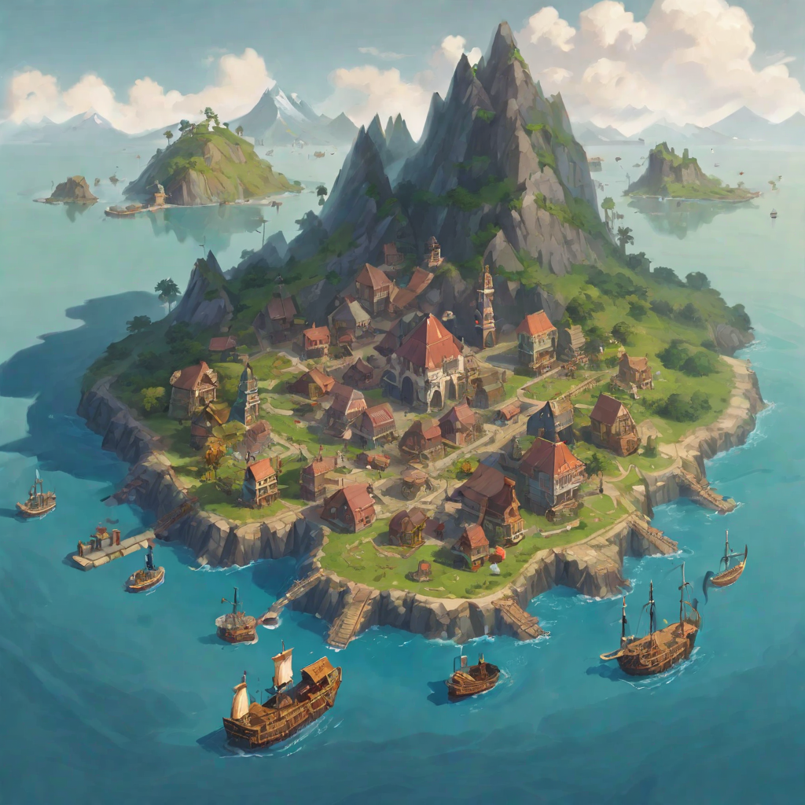
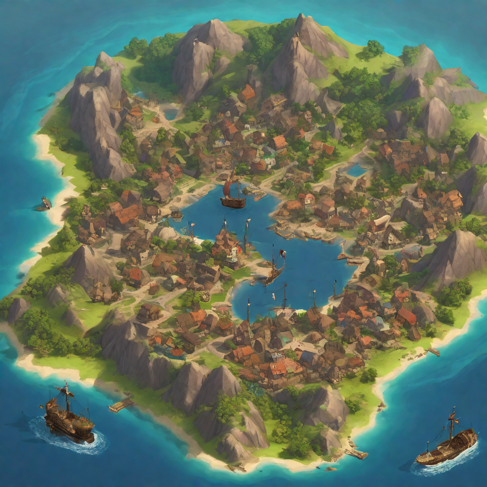

# Fischia

Tags: Città, Luogo
Creatore: Davide

# Fischia

---

Informazioni Generali

Tipo di Luogo: Isola

Dimensioni:

Altitudine: 600 m slm

Popolazione:

Paese: Azura

Luogo:

Alleata con: Azura

Attività: Commercio, turismo

---

## 1. Descrizione Generale

---

L'Isola di Fischia è una pittoresca isola situata nel cuore del Mare di Smeraldo, famoso per le sue acque cristalline e la bellezza naturale mozzafiato. Caratterizzata da una posizione strategica nello stretto marittimo della regione, l'isola è amministrata dalla maestosa città di Azura, situata a breve distanza di navigazione. Il nome dell'isola deriva dalla sua orografia unica, che durante giornate ventose genera melodie simili a fischi, creando un'atmosfera magica.

## 2. Storia

---

L'Isola di Fischia, con la sua storia avvincente e stratificata, ha sempre affascinato gli storici e gli appassionati di archeologia. Le prime tracce umane risalgono a tempi antichissimi, con reperti archeologici che testimoniano la presenza di una civiltà preistorica che si insediò sull'isola migliaia di anni fa. Questi antichi abitanti, noti come gli "Scopritori del Vento" per la loro venerazione dei suoni prodotti dal vento tra le montagne, hanno lasciato dietro di sé incisioni rupestri enigmatiche e misteriosi siti cerimoniali che sono tuttora oggetto di studio e di ammirazione.

Nel corso dei secoli successivi, l'Isola di Fischia fu teatro di molteplici culture e dominazioni. Durante l'epoca medievale, fu contesa tra regni rivali alla ricerca di posizioni strategiche nel Mare di Smeraldo. I forti e le torri di avvistamento costruiti su promontori rocciosi testimoniano la lotta per il controllo dell'isola.

Tuttavia, uno dei capitoli più importanti della storia di Fischia ebbe inizio quando l'imponente città di Azura la reclamò come proprio possedimento nel XVIII secolo. L'isola divenne rapidamente una postazione marittima cruciale per Azura, con il porto di Fischia che si sviluppò rapidamente per accogliere le navi mercantili provenienti da ogni angolo del mondo. La prosperità economica e culturale che ne derivò trasformò l'isola in un gioiello di bellezza e diversità.

Nel corso dei secoli, l'amicizia tra l'Isola di Fischia e Azura si è consolidata, portando a una lunga era di stabilità e cooperazione. Azura ha contribuito alla conservazione del patrimonio storico dell'isola, restaurando antichi siti e proteggendo le tradizioni locali, mentre l'isola ha fornito risorse naturali e beni di lusso che hanno arricchito la città madre.

Oggi, l'Isola di Fischia è un esempio vivente di come la storia e la modernità possano coesistere armoniosamente. Gli abitanti dell'isola onorano il loro passato celebrando le tradizioni antiche, mentre si abbracciano le opportunità del futuro. Il legame indissolubile tra Fischia e Azura continua a prosperare, garantendo un futuro luminoso per questa affascinante isola nel cuore del Mare di Smeraldo.

## 3. Geografia

---

L'Isola di Fischia è un gioiello geografico circondato dalle acque turchesi del Mare di Smeraldo. La sua topografia è caratterizzata da maestosi monti che attraversano l'isola, creando una serie di valli e piccole pianure. Questi monti, noti per il loro contributo ai fischi melodiosi durante le giornate ventose, sono coperti da foreste lussureggianti e arricchiti da flora e fauna uniche.

## 4. Economia

---

L'economia dell'Isola di Fischia è strettamente legata al commercio marittimo, grazie alla sua posizione strategica nello stretto marittimo. Le principali fonti di reddito includono il commercio di merci provenienti da tutto il mondo, la pesca abbondante grazie alle acque ricche di vita marina e il turismo, attratto dalle bellezze naturali dell'isola e dalla sua cultura unica. I mercati locali abbondano di prelibatezze ittiche, prodotti agricoli freschi e artigianato locale, contribuendo alla prosperità dell'isola.

## 5. Cultura

---

L'Isola di Fischia è un crocevia di culture grazie al suo passato di dominazioni diverse. La cultura locale riflette questa diversità, con influenze culinarie, artistiche e musicali provenienti da tutto il mondo. Gli abitanti dell'isola sono noti per la loro ospitalità e il loro orgoglio per le tradizioni locali. Artisti locali dipingono paesaggi ispirati alla bellezza naturale circostante, mentre i musicisti si esibiscono nei caratteristici suoni dei fischi melodia durante le giornate ventose.

## 6. Governo

---

L'Isola di Fischia è amministrata da Azura, una città marittima di risonanza che ha garantito stabilità e sicurezza all'isola negli ultimi due secoli. Il governo locale opera sotto la guida di un sindaco eletto democraticamente, che collabora strettamente con le autorità di Azura per gestire le questioni amministrative e promuovere lo sviluppo sostenibile dell'isola. La collaborazione tra l'isola e la città madre ha portato a una cooperazione efficace nei settori dell'educazione, della sanità e dell'infrastruttura, garantendo un elevato standard di vita per gli abitanti di Fischia.

---