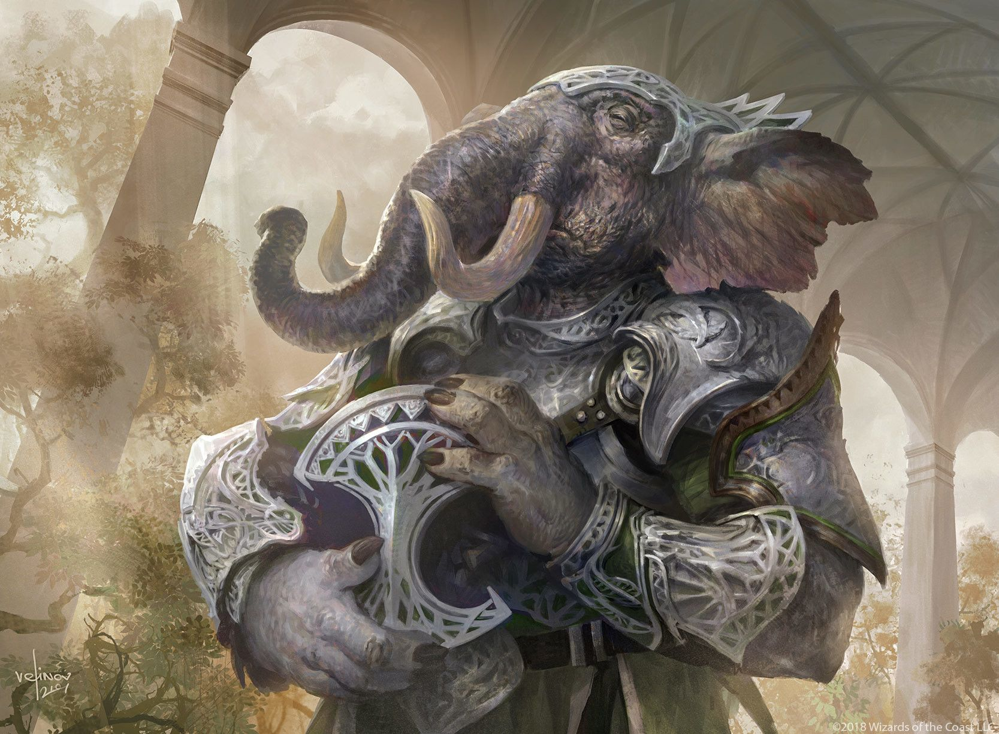

# Fran

Tags: NPC, Quartiermastro
Creatore: Lorenzo

# Fran

---

Informazioni Generali

Anno di nascita: 1776

Paese di nascita: Foresta degli Elefarici

Razza: Lossodonte

Relazioni:

Alleati:

Nemesi:

Possedimenti importanti:

---

## 1. Descrizione Generale

---

Fran è il quartiermastro della Gilda dei Protettori di Eldrid.

Fran è un lossodonte dall'aspetto imponente, con un corpo massiccio e una pelle grigia rugosa che gli conferisce un'aria saggia. Nonostante la sua mole, è sorprendentemente agile e porta sempre con sé un mantello colorato con frange e ricami eccentrici. Indossa un'armatura personalizzata, progettata appositamente per adattarsi alla sua figura robusta. Porta sempre con se un piccolo baule, contenente tutto il necessario per le sue responsabilità di quartiermastro della gilda dei Protettori.

## 2. Biografia

---

Fran è nato nella lussureggiante foresta degli Elefarici, una terra d’oltreoceano abitata da lossodonti. Crescendo, ha sviluppato una passione per l'esplorazione, che lo ha portato fino a Eldrid. Dopo aver appreso delle gesta dei Protettori, ha deciso di unirsi a loro e mettere le sue abilità al servizio della gilda.

## 3. Carriera

---

Dopo aver dimostrato la sua abilità nelle missioni di combattimento, Fran è stato nominato quartiermastro della gilda dei Protettori di Eldrid. Con la sua natura socievole, è riuscito a stringere amicizia con mercanti e commercianti, ottenendo sconti incredibili per le ultime novità sul mercato.

## 4. Personalità

Fran è un lossodonte dal cuore tenero e un gran senso dell'umorismo. Anche se il suo aspetto intimidatorio potrebbe far pensare il contrario, è amato e rispettato dai membri della gilda per il suo spirito allegro e la sua capacità di alleviare la tensione durante le missioni pericolose. Spesso scherza sul suo aspetto mastodontico, definendosi "l'elefante nella stanza". Nonostante la sua comicità, Fran è un individuo estremamente competente e leale, sempre pronto a difendere i suoi compagni con la sua forza e astuzia.

La combinazione unica di abilità di combattimento, competenza organizzativa e personalità gioiosa rende Fran un membro essenziale della gilda dei Protettori di Eldrid. La sua presenza nella squadra porta un senso di calma e fiducia, e i suoi amici sanno di poter contare su di lui sia come compagno di avventure che come responsabile delle risorse.

---

## A. Coinvolgimenti in eventi recenti

---

[Untitled Database](Untitled%20Database%20c977bec678f84b799a4925770fa66698.csv)

## B. Aggiornamenti

---

