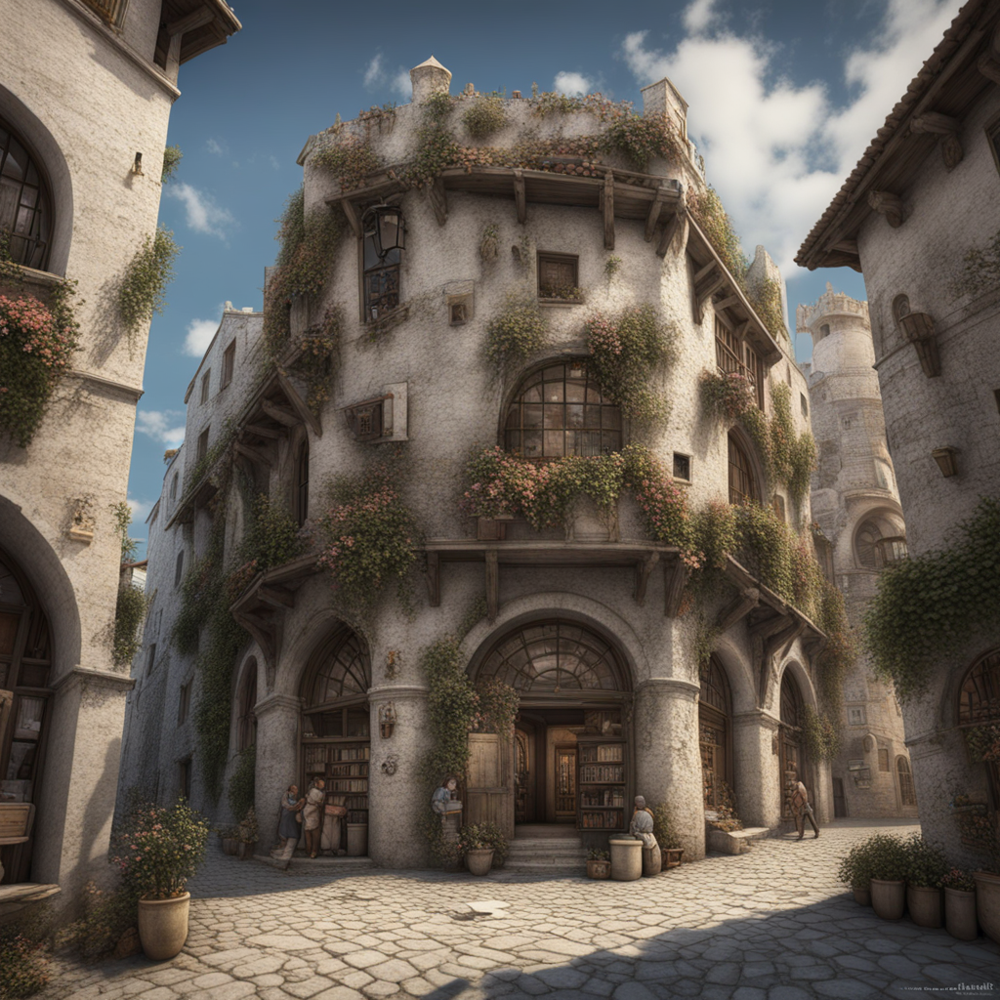

# Gilda dei protettori della Sila Devoti a San Francesco e ai Lupi

Tags: Organizzazione
Creatore: Davide, Lorenzo

# **Gilda dei Protettori della Sila Devoti a San Francesco e ai Lupi**

---

---

Informazioni Generali

Tipo: Gilda

Struttura:

Regione: Valtara

Fondatore: Paladini di San Francesco

Membri: I Protettori

Alleati: Ordine dei Paladini di San Francesco

Nemesi: 

## 1. Descrizione Generale

---

La Gilda dei Protettori della Sila Fedele a San Francesco e ai Lupi, nota semplicemente come Gilda dei Protettori, è un organizzazione fondata dai paladini e composta da avventurieri devoti a San Francesco e ai valori della giustizia e dell'onore. Con base a Kos, la città natale di San Francesco, operano in difesa del bene e della compassione. Accettano membri diversificati, impegnandosi in missioni di pacificazione e lotta al male in tutta Valtara. Collaborano strettamente con le autorità locali per mantenere l'ordine e la sicurezza.

*Il Pane Quotidiano* è un rinomato giornale nel mondo di Valtara, noto per la sua dedizione nell'offrire una copertura completa e accurata degli avvenimenti in . Fondata con l'obiettivo di soddisfare la sete di conoscenza e la curiosità dei suoi lettori, questa organizzazione giornalistica ha stabilito la sua sede principale nella maestosa città di Kos.

> “Giuro fedeltà ai compagni e alla gilda.
Giuro fedeltà al lupo che con la sua forza guida i nostri passi.
Giuro fedeltà allo spirito di San Francesco che ci protegge in ogni viaggio.
Lupi alé! Lupi alé! Lupi alé!”
> 
> 
> -Giuramento della gilda
> 

## 2. Storia

---

La Guerra del Sangue fu un evento tragico che rimase impresso nella memoria dei paladini dell’ [Ordine dei Paladini di San Francesco](Ordine%20dei%20Paladini%20di%20San%20Francesco%20e8fd423783714ddeb11ec757edea519b.md)  come un duro ammonimento della perfidia umana e della necessità di rimanere sempre vigili contro le forze oscure che cercano di distruggere il bene. 

Per questo motivo decisero di riorganizzare la milizia costituita in occasione della guerra, fondando una gilda, la Gilda dei Protettori della Sila Devoti a San Francesco e ai Lupi, nota in seguito come la Gilda dei Protettori. La gilda sarebbe stata aperta a chiunque fosse desideroso di combattere il male, purché avesse una forte fede in San Francesco e nei valori della giustizia e della compassione. La Gilda dei Protettori della Sila Devoti a San Francesco e ai Lupi divenne rapidamente un'organizzazione rispettata e temuta in egual misura.

Non solo la Gilda ripristinò la reputazione dell'ordine dei Paladini di San Francesco, ma la superò, diventando una forza potente e influente nella lotta contro il male. La loro determinazione e la loro dedizione alla causa ispirarono molti altri, portando la Gilda oltre i confini della città natale. Oggi, dopo più di 20 anni dalla sua nascita, la Gilda è diventata un’organizzazione complessa e ramificata, con una sede in ogni grande città di Valtara. Nonostante sua nobile origine, la Gilda permette ai suoi membri di accettare i più disparati incarichi, a volte al limite dell’etica. Questo elemento è preso ad esempio dai critici più feroci dell’organizzazione, che credono che la Gilda abbia poco a che fare con l’antico Ordine dei Paladini di San Francesco, poiché ormai composta da mercenari al soldo del miglior offerente.

## 3. Valori

---

I valori chiave della Gilda dei Protettori includono la giustizia, la compassione, la fedeltà, il coraggio, l'unità, il sacrificio, la fede, l'onestà, la determinazione e la responsabilità. Questi principi guidano i membri della Gilda nelle loro azioni e decisioni mentre lottano per proteggere gli innocenti, preservare la giustizia e combattere il male in modo equo e determinato. La Gilda promuove l'unità e la cooperazione tra i suoi membri, insieme alla compassione verso coloro che sono in difficoltà. La fede in San Francesco è un pilastro importante, e l'onestà e l'integrità sono altamente valorizzate. I Protettori sono noti per il loro coraggio e la loro determinazione nell'affrontare le sfide, e sono pronti a fare sacrifici personali per il bene comune. Infine, la responsabilità verso la protezione degli innocenti e il perseguimento della giustizia è un obiettivo centrale per la Gilda.

## 4. Cultura

---

La cultura della Gilda dei Protettori è profondamente radicata nei valori di devozione a San Francesco e nella sua connessione con la città di Kos, luogo di nascita del San. Questo legame con San Francesco rappresenta il cuore e l'anima della Gilda, influenzando profondamente il suo carattere e la sua missione.

 San Francesco è venerato come guida spirituale dai membri della Gilda. La sua filosofia di amore per la natura, compassione e dedizione ai valori della giustizia è il fondamento su cui si basano le azioni della Gilda.

 Nonostante la Gilda sia nata a Kos, i suoi valori sono condivisi universalmente e abbracciati dai membri di tutte le sedi. La devozione a San Francesco, la promozione della giustizia, la compassione verso gli oppressi e il coraggio nel combattere il male sono principi condivisi che uniscono tutti i Protettori, ovunque essi si trovino. Questo senso di unità permette alla Gilda di operare in modo sinergico in tutta Valtara.

### 4.1 Educazione & Apprendistato

---

Per diventare Protettori, bisogna dimostrare devozione a valori come la giustizia, la compassione e San Francesco. Un membro esistente deve sponsorizzare l'aspirante. Dopo, si passa per la formazione, attraverso la quale l’aspirante membro viene a conoscenza del modus operandi della Gilda. In seguito, solo se necessario, si passa all’addestramento e si affrontano incarichi vari. La dedizione costante è essenziale. Infine, si partecipa a una cerimonia di accettazione. 

## 5. Attività

---

Le attività principali dei Protettori includono:

1. Missioni di salvataggio: Salvataggio di persone in pericolo, compresi ostaggi e vittime di calamità.
2. Giustizia e ordine: Mantenimento della pace, protezione da criminali e risoluzione di conflitti.
3. Esplorazione: Scoperta di luoghi misteriosi, antiche rovine o minacce oscure.
4. Sostegno umanitario: Aiuto a comunità bisognose attraverso donazioni e assistenza.
5. Battaglia contro il male: Combattimento contro creature oscure, culti maligni e minacce sovrannaturali.
6. Formazione: Addestramento di nuovi membri e sviluppo personale.
7. Diplomazia: Negoziazione di accordi tra città e gruppi.
8. Raccolta di informazioni: Ricerca e analisi di informazioni cruciali per la sicurezza.

### 5.1 Sedi della Gilda

---

I Protettori si concentrano su valori universali, espandendo la loro presenza in molte città. Ad oggi la Gilda ha il proprio quartier generale nella città di Kos, e altre 6 filiali sparse nella regione di Valtara, per un totale di 7 sedi:

Una sede in ognuna delle 4 Città-Stato: Kos, Azura, Vento Celeste e Eldrid;

Una sede nella città minore di Altrosguardo;

Una sede della città minore di Bellavalle;

Una sede nella città minore di Metauros.

Oltre alle sedi principali ci sono rappresentanze (che fanno capo ad una delle sedi sopra citate) in altri villaggi, città o stati che fanno donazioni regolari alla Gilda.

### 5.2 Rappresentanze e Aree d’intervento

Le Rappresentanze sono situate in villaggi, città o stati che sostengono economicamente le attività della Gilda, e che contemporaneamente si trovano lontano dalle sedi centrali. In questi luoghi, la Gilda ha eretto veri e propri uffici, presidiati da gruppi di Protettori che vi risiedono permanentemente.

La missione primaria di queste Rappresentanze è stabilire un contatto diretto con le amministrazioni locali. I Protettori Rappresentanti fungono da tramite tra la Gilda e le comunità che servono, facilitando la comunicazione e rispondendo alle esigenze locali.

Le Rappresentanze operano come centri decisionali per gli incarichi meno urgenti o di minore complessità.

Tuttavia, quando si presentano situazioni più delicate o che richiedono una maggiore preparazione, la Rappresentanza consulta la sede centrale.

Le richieste vengono valutate caso per caso, e la decisione di assumere direttamente l'incarico o di inviarlo alla sede principale è basata sulle disponibilità (di risorse o di protettori), sul livello di difficoltà e sull'urgenza della situazione.

Ogni sede della Gilda ha una ben precisa area d’intervento. Le aree d’intervento vengono delineate direttamente dal Consiglio Supremo, che si riunisce ogni 10 anni per approvare il Piano d’Intervento (strumento con il quale vengono confermate o ridisegnate le aree d’intervento in base a questioni geografiche o culturali)

Le aree di intervento possono essere suddivise a loro volta in settori. Questa suddivisione avviene solo se presente una o più Rappresentanze e viene approvata direttamente dalla sede di riferimento.

Di seguito la suddivisione di Valtara in aree d’intervento approvata dall’ultimo Piano d’Intervento:

- **Area d’Intervento A**: A1 Settore principale Kos; A2 Settore secondario Vallekratos; A3 Settore secondario Paoland; A4 Settore secondario Al Manthia.
- **Area d’Intervento B**: B1 Settore principale Azura; B2 Settore secondario Valleverida.
- **Area d’Intervento C**: C1 Settore principale Eldrid; C2 Settore secondario Goldendor; C3 Settore secondario Fredo Flu; C4 Settore secondario Verd.
- A**rea d’Intervento D**: D1 Settore principale Vento Celeste; D2 Settore secondario Forregard.
- **Area d’Intervento E**: E1 Settore principale Bellavalle; ES Settore speciale Dira Mare.
- **Area d’Intervento F**: F1 Settore principale Metauros; F2 Settore secondario Kaulos.
- **Area d’Intervento G**: G1 Settore principale Altrosguardo.

.jpg)

## 6. Struttura gerarchica

---

 Il **Consiglio Supremo** è il massimo organo direttivo della Gilda dei Protettori, e ha autorità su tutte le sedi della gilda sparse per Valtara. La responsabilità principale del Consiglio è quella di prendere decisioni strategiche a livello globale e guidare la gilda nella sua missione di proteggere Valtara da ogni minaccia.

- Il Consiglio, un organismo flessibile, può essere composto da un numero variabile di membri (sempre dispari), selezionati in base ai meriti, sia internamente che esternamente alla gilda: rinomati uomini politici, filantropi, o comunque persone con una comprovata dedizione al bene e alla tutela degli indifesi.
- Le riunioni del Consiglio sono pianificate periodicamente, ma la sua sede è mobile. La scelta del luogo di incontro dipende da fattori di convenienza e urgenza (ad esempio, se si devono affrontare questioni relative alla sede di Azura, la riunione si terrà ad Azura). La partecipazione dei Comandanti Generali delle diverse sedi alle riunioni è altamente consigliata, sebbene non obbligatoria.

### 6.1 **Posizioni principali all’interno di ogni sede della Gilda**

- **Comandante Generale:** Ogni sede della gilda ha un Comandante Generale che funge da leader locale. Questi individui sono responsabili delle operazioni quotidiane della loro sede, coordinando le missioni e supervisionando i membri della gilda assegnati a quella sede specifica. Sono nominati dal Consiglio e devono dimostrare competenza e leadership.
- **Ufficiali Superiori:** Sotto il Comandante Generale, ci sono gli Ufficiali Superiori. Questi ufficiali sono responsabili di specifici settori o divisioni all'interno della sede, come la formazione delle reclute, la logistica o la strategia. Collaborano direttamente con il Comandante Generale e aiutano a prendere decisioni importanti.
- **Capitani di Squadra:** I Capitani di Squadra sono Protettori che si sono particolarmente distinti nella loro carriera per coraggio e dedizione alla causa. Sono responsabili del comando e del controllo delle unità operative della gilda. Ad una squadra viene assegnato un capitano per missioni altamente pericolose o di vitale importanza.
- **Protettori Esperti:** Questi sono avventurieri esperti che costituiscono la forza principale della gilda. Sono responsabili dell'esecuzione delle missioni assegnate loro e svolgono un ruolo cruciale nella protezione di Valtara.
- **Reclute:** I nuovi membri che si uniscono alla gilda iniziano come reclute. Vengono addestrati e sottoposti a un periodo di prova per dimostrare le loro abilità e il loro impegno. Una volta dimostrata la loro competenza, possono avanzare a posizioni superiori.

### 6.2 **Altre posizioni**

- **Quartiermastro:** Il Quartiermastro è responsabile della gestione delle risorse materiali della gilda, inclusi armamenti, equipaggiamento e rifornimenti. Assicura che tutto il personale abbia ciò di cui ha bisogno per le operazioni.
- All'interno della gilda ci sono anche posizioni amministrative come scribi, responsabili della documentazione delle missioni, o logistici, incaricati della gestione delle risorse e dell'approvvigionamento.

[Untitled Database](Untitled%20Database%2077b97fb33d1b4871909da1f0d726e8dc.csv)