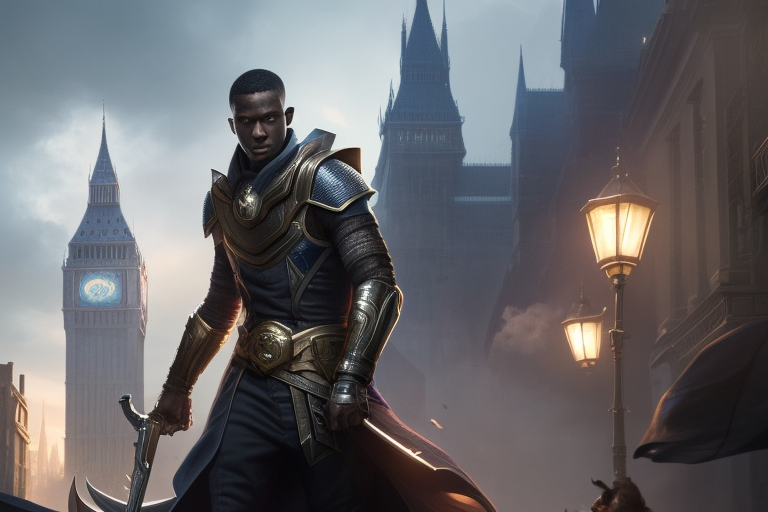

# Hakram

Tags: NPC
Creatore: Lorenzo
Ispirazione: Hart Marjok, ovviamente.

akram

# Hakram

---

.png)

Informazioni Generali

Età: 27

Data di nascita: 1997

Luogo di nascita: Foresta dei Giganti

Razza: Mezz’elfo

Classe: Ladro

Alleati:

Nemesi: Impero Dishartiano

Alias:

Professione: Ladro

---

## 1. Descrizione Generale

---

Hakram è un affascinante mezz'elfo con occhi vivaci, pelle e capelli scuri. La sua agilità naturale è evidente in ogni movimento, e la sua postura è sempre rilassata, pronto a sfuggire a qualsiasi situazione pericolosa.

## 2. Biografia

---

Cresciuto tra gli alberi dell’oscura Foresta dei Giganti da un vecchio nano, Hakram non ha mai conosciuto i suoi genitori biologici. Dopo la morte di suo padre adottivo, avvenuta quando aveva solo 14 anni, ha imparato rapidamente le arti dell'inganno, del furto e della fuga, diventando un abile ladro, girovago tra i villaggi e le città di Valtara. Nonostante la sua vita criminale, ha un codice morale che gli impedisce di fare del male a chi non se lo merita. Al momento nessuno sa dove siano Hakram e Leona, ne se siano ancora vivi.

## 3. Carriera

---

Dopo anni a vagare senza meta, Hakram si è stabilito nella capitale Dishartiana, dove è diventato uno dei ladri più famosi per le sue abilità di scasso e infiltrazione. È noto per i suoi colpi audaci e sfuggenti, che gli hanno guadagnato rispetto tra i suoi compagni criminali. La sua conoscenza dei luoghi e delle vie nascoste della capitale dishartana è insuperabile, il che lo rende un compagno inestimabile per qualsiasi colpo. L’imperatore ha messo sulla sua testa una taglia di 10000 monete d’oro.

## 4. Personalità

---

Nonostante la sua professione, Hakram è un individuo affabile e simpatico. Ha un senso dell'umorismo tagliente e sa come tranquillizzare gli altri con la sua presenza rassicurante. È un romantico e ha un lato gentile che riserva solo a coloro che hanno guadagnato la sua fiducia.
L'incontro con la principessa Leona ha trasformato la sua vita. Si è innamorato profondamente di lei, e ora, con la notizia della prossima paternità, è determinato a proteggere la principessa e il loro bambino da qualsiasi minaccia che si profili all'orizzonte, in particolar modo dalle responsabilità della corona. La sua abilità nel mondo dei ladri e il suo sentimento d’amore lo hanno reso un partner devoto e pronto a tutto.

## A. Coinvolgimenti in Eventi Recenti

---

[Untitled Database](Untitled%20Database%2049897c1ada034aeebc6c1efae06d3b26.csv)