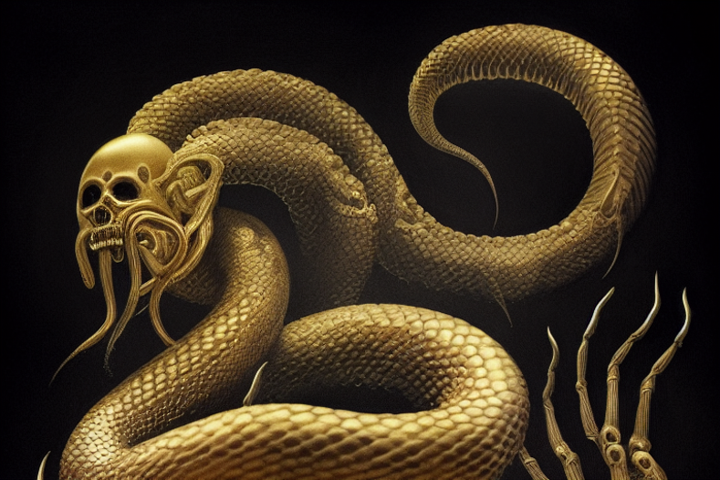
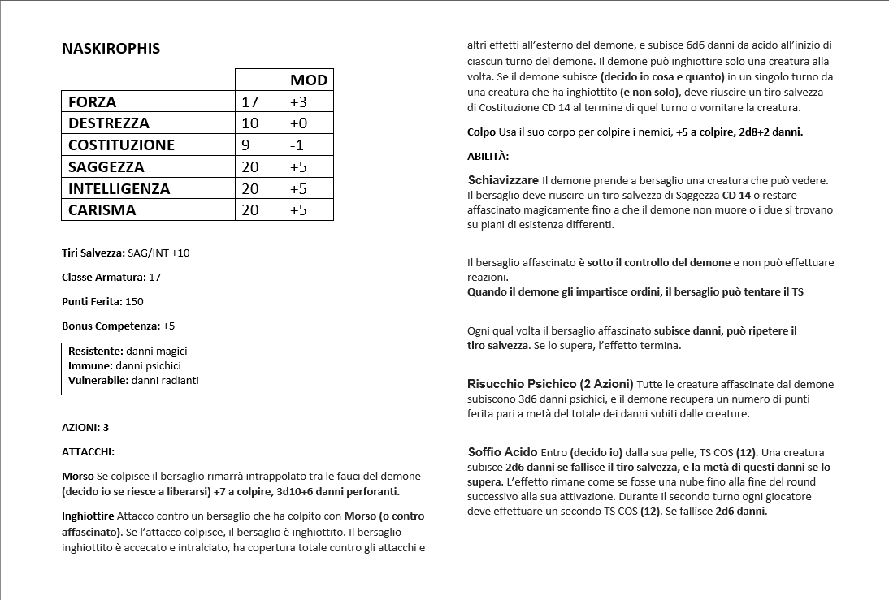

# Naskirophis

Tags: Creatura
Creatore: Lorenzo

# Naskirophis

---

Informazioni Generali

Età: ?

Anno di nascita: ?

Paese di nascita: Valtara

Razza: Demone

Relazioni: 

Alleati: Setta del Sangue

Nemesi: Ordine dei Paladini di San Francesco; Gilda dei Protettori

Possedimenti importanti:

---

## 1. Descrizione Generale

---

La sua forma ibrida, con la testa di un infante e il corpo longilineo come quello di un serpente, rappresenta una perversione dei valori umani e simboleggia la corruzione dell'innocenza stessa.

> *Posso far in modo che la morte non bussi mai alla vostra porta, o che bussi alla porta dei vostri nemici,*
> 
> 
> *Posso rendervi in grado di ascoltare i pensieri degli altri, e di controllarli a vostro piacimento,*
> 
> *Posso rendervi possenti animali feroci, inarrestabili e inamovibili,*
> 
> *E infine, posso donarvi la verità, il dono più pesante di tutti.*
> 

## 2. Biografia

---

La storia di Naskirophis risale a tempi antichi, quando si dice che sia stato evocato da un oscuro incantesimo proibito.

*Secondo le storie, Naskirophis è stato evocato da un potente e perverso stregone chiamato Zephramos, un oscuro studioso delle arti proibite, desideroso di ottenere potere e dominio assoluto. La sua sete di potere e la brama di conoscenza proibita lo spinsero ad affrontare il pericoloso rituale di evocazione. Cercava un mezzo per ottenere il controllo di un potente demone che potesse soggiogare le volontà degli uomini e piegarle al suo volere. Il demone rispose all'invocazione di Zephramos, manifestandosi nella sua terrificante forma, ma si rivelò essere una forza incontrollabile, pronta a corrompere e distruggere tutto ciò che toccava. Il demone si ribellò al controllo dello stregone e decise di seguire il proprio oscuro percorso di distruzione e morte.*

Naskirophis ha la capacità di esaudire le richieste di coloro che riescono a raggiungerlo nella sua tana maledetta. Tuttavia, il prezzo richiesto è orribile: un neonato deve essere offerto come sacrificio, la cui carne verrà consumata dal demone stesso. La **Setta del Sangue**, animata dal desiderio di potere e dal culto della distruzione, accoglie questa richiesta come una prova suprema della loro devozione e come un mezzo per ottenere i favori di Naskirophis.

Per molti secoli, la Setta del Sangue agì come servitrice del demone, ottenendo in cambio poteri divini che utilizzò per perseguire i suoi malvagi obiettivi. Grazie all'alleanza con il demone, la setta riuscì a infiltrarsi nell'Ordine dei Paladini di San Francesco, infliggendo loro gravi danni e minacciando la loro esistenza.

Tuttavia, durante il corso della Guerra del Sangue, i Paladini emersero vittoriosi. Attraverso strenui sforzi e sacrifici, riuscirono a sconfiggere la Setta del Sangue e a intrappolare il demone in una prigione dimensionale.

Dopo decenni di prigionia, pare che il demone avesse finalmente trovato un varco per sfuggire dalla sua prigione.

Tuttavia, prima che il demone potesse riacquistare il suo pieno potere, si verificò un evento inaspettato. Un gruppo di valorosi individui della Gilda dei Protettori si alzò per affrontare la minaccia riemergente, riuscendo a uccidere il demone, privando di fatto a ciò che è rimasto della Setta la sua arma più potente.

Di seguito i Protettori che hanno affrontato e sconfitto il demone:

**Pippo Francfrog**, Capitano della Gilda dei Protettori di Kos;

**Dorian Be**, Capitano della Gilda dei Protettori di Kos;

**Disis Lulukinfor**, Capitano della Gilda dei Protettori di Kos;

**Sabaku No Darude**, Capitano della Gilda dei Protettori di Kos.

## 3. Personalità

---

## 4. Coinvolgimenti in eventi recenti

---

[Untitled Database](Untitled%20Database%20d9fe95ba212a4a62853a4959637c5a88.csv)

## 6. Scheda personaggio

---

[Info PG](Info%20PG%204d827ff2807f4020b43bdae278238fa1.csv)

### Statistiche e abilità

---

[Abilità](Abilita%CC%80%20da1538d735de4e138ef5740acbc7e0a6.csv)

### Lista magie

## A. Descrizione originale

---