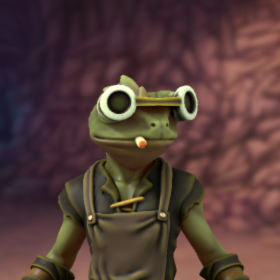
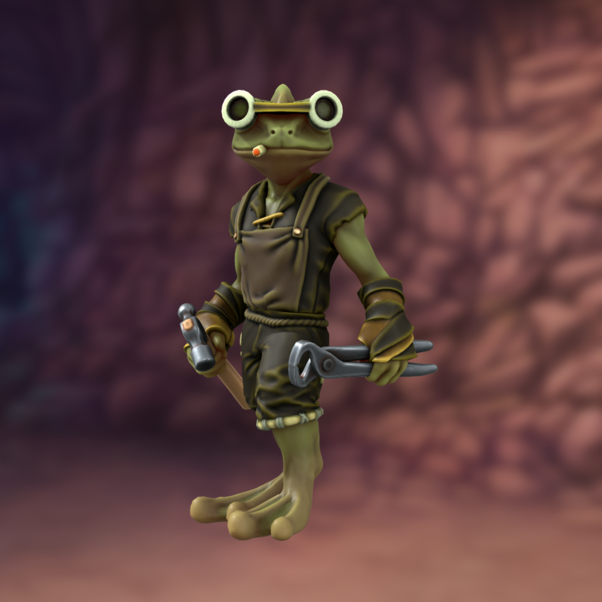

# Pippo Francfrog

Tags: PC
Alias: La Rana Esplosiva
Creatore: Francesco G.
Giocatore: Francesco Gabrielli
Ispirazione: Pippo Franco 
Luogo: Kos
Razza: Frogfolk
Classe: Artificiere
Livello: 10

# Pippo Francfrog

---

Informazioni Generali

Età:

Anno di nascita:

Paese di nascita:

Razza: Frogfolk

Relazioni:

Alleati:

Nemesi:

Possedimenti importanti: 

---

## 1. Descrizione Generale

---

Pippo Francfrog incarna l'incantevole fusione di una rana umanoide e la magia dell'intrattenimento. La sua pelle iridescente rivela radici anfibie, mentre lo sguardo intelligente brilla di carisma. Con abiti vivaci e un sorriso contagioso, Pippo attrae l'attenzione ovunque vada. La sua natura di artista si riflette in ogni gesto, mantenendo viva la luce del palcoscenico anche mentre esplora nuovi orizzonti.

> “Torte in faccia!”
> 

## 2. Biografia

---

### 2.1 Infanzia e le Origini Mistiche

Pippo Francfrog vide la luce grazie a un incantesimo complesso e ardito lanciato dal mago Lasalmadi Mikebongiorno. La sua creazione era un tentativo di fondere la magia con il mondo dell'intrattenimento, producendo così una creatura unica nel suo genere. Sin dalla sua nascita, Pippo ha portato con sé un legame con la magia che avrebbe influenzato il corso della sua vita.

### 2.2 **Esordi in "Il Bagaglione"**

I primi passi di Pippo nel mondo dell'intrattenimento li compì entrando a far parte dello spettacolo itinerante de "Il Bagaglione". Qui, Pippo fu introdotto all'arte dell'intrattenimento e imparò i segreti dell'interazione con il pubblico. Le sue performance coinvolgenti e innovative catturarono l'attenzione di tutti coloro che ebbero la fortuna di assistere ai suoi numeri.

### 2.3 **Richiamo della Magia e il Percorso come Artificiere**

Mentre il suo talento nel campo dell'intrattenimento si faceva sempre più evidente, la sua connessione con la magia iniziò a emergere in modo più preponderante. Sentendo il richiamo della magia dentro di sé, Pippo intraprese un nuovo cammino come artificiere. La sua abilità nel creare oggetti incantati e invenzioni uniche gli permise di esprimere la sua creatività in modi mai sperimentati prima.

### 2.4 **Unione Fraterna con Pippo Baudog**

Le avventure di Pippo non furono mai solitarie. Insieme a suo fratello Pippo Baudog, un cane antropomorfo con il medesimo retaggio magico, intraprese molte imprese. La loro partnership rappresentava l'armoniosa fusione tra intrattenimento e abilità magica, dimostrando il valore dell'affetto fraterno nel raggiungimento dei traguardi.

### 2.5 **Eredità e Impatto**

La vita di Pippo Francfrog è rimasta una testimonianza dell'incrocio tra il mondo della magia e dell'intrattenimento. La sua biografia incarna la perseveranza nella ricerca della propria passione, nonostante le diverse sfaccettature della sua identità. La sua eredità continua a ispirare coloro che cercano di fondere passioni divergenti, aprendo la strada a un mondo di meraviglia, sorpresa e collaborazione.

## 3. Carriera

---

La carriera di Pippo Francfrog è stata un connubio straordinario tra magia e intrattenimento. Dopo esordi di successo con lo spettacolo itinerante de "Il Bagaglione", Pippo ha seguito il richiamo della magia e si è dedicato all'artigianato magico come artificiere. Nonostante questo cambiamento di percorso, non ha mai dimenticato le sue radici da intrattenitore, portando sempre con sé il desiderio di incantare e stupire il pubblico. Collaborando spesso con suo fratello, Pippo Baudog, ha dimostrato come la fusione di talento e creatività possa creare un'esperienza unica e indimenticabile per chiunque lo incontri. La sua carriera è un esempio di come diverse passioni possano coesistere e arricchirsi a vicenda, creando un mondo di meraviglia e sorpresa.

## 4. Personalità

---

La personalità di Pippo Francfrog è un affascinante mix di carisma, curiosità e creatività. È un individuo straordinariamente affabile, con un sorriso contagioso e uno sguardo che riflette un'intelligenza brillante. La sua natura di intrattenitore è evidente in ogni aspetto della sua vita, portando con sé l'abilità di incantare e stupire chiunque incontri. La sua curiosità insaziabile lo spinge a esplorare nuovi orizzonti, sia nell'arte dello spettacolo che nell'artigianato magico. Tuttavia, il suo cuore rimane fedele al desiderio di portare gioia e meraviglia al pubblico, e questa passione è il motore che guida ogni sua azione. La sua personalità è un richiamo costante alla magia della creatività e all'importanza di diffondere la gioia attraverso l'arte e lo spettacolo.

## 5. Coinvolgimenti in eventi recenti

---

[Untitled Database](Untitled%20Database%2035b391282a354aefb762c6cbe4670abc.csv)

## 6. Scheda personaggio

---

[Info PG](Info%20PG%2075172870926b4488a518a676f6c59d30.csv)

### Statistiche e abilità

---

[Abilità](Abilita%CC%80%206c389f50c35f46369e8056828b53fcb0.csv)

### Lista magie

## A. Descrizione originale

---

Pippo Francfrog, una rana umanoide, e suo fratello Pippo Baudog, un cane antropomorfo,
erano creature uniche nel loro genere. Creati dal mago Lasalmadi Mikebongiorno con
l'ambizioso scopo di diventare i conduttori televisivi più talentuosi mai visti, i due fratelli
avevano ciascuno una strada differente da percorrere.
Fin da giovane, Pippo Baudog dimostrò un carisma naturale e una passione per
l'intrattenimento. Il suo talento era innegabile, e presto divenne il conduttore di spicco della
Sagra della Canzone di Sam Reno, conducendo con maestria numerose edizioni
dell'evento amato da tutti.
Dall'altra parte, Pippo Francfrog si unì allo spettacolo itinerante de "Il Bagaglione". Durante
il periodo trascorso con il collettivo, Pippo Francfrog imparò l'arte dell'intrattenimento e si
esibiva con il suo vecchio gruppo in numeri coinvolgenti e straordinari. Tuttavia, il richiamo
della sua natura da artificiere divenne sempre più forte.
Così, dopo un certo periodo di successo con "Il Bagaglione", Pippo Francfrog decise di
seguire la sua vera passione e si dedicò alla professione di artificiere. La creazione di
oggetti magici e invenzioni uniche gli permise di esprimere il suo talento creativo e di
utilizzare la sua innata abilità nella magia.
Nonostante la sua scelta, Pippo Francfrog non dimenticò mai le sue origini da conduttore.
Durante le avventure che intraprendeva insieme a Pippo Baudog e il loro gruppo di
compagni, o insieme a nuovi compagni, non esitava a riproporre alcuni dei suoi vecchi
numeri, portando ancora una volta gioia e stupore ai suoi spettatori.
Pippo Francfrog e Pippo Baudog continuarono insieme a vivere saltuariamente avventure
emozionanti, unendo le loro abilità uniche per affrontare sfide e pericoli. L'amore fraterno
che li legava era indissolubile, e il loro rapporto di collaborazione e sostegno reciproco li
rese una coppia imbattibile.