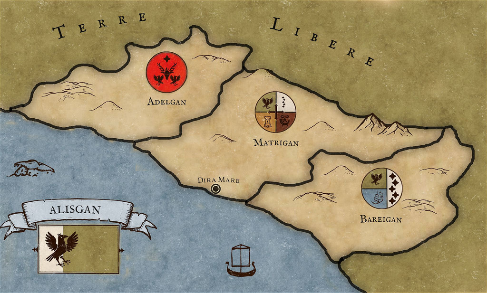

# Regno degli Alisei

Tags: Stato
Creatore: Lorenzo

# Regno degli Alisei

---

.png)

Informazioni Generali

Nome Ufficiale: Alisgan

Lingue Ufficiali: Aliseo, Comune Valtarese

Capitale: Dira Mare

Forma di Governo: Repubblica

Popolazione: 

Superficie: 

Continente: Valtara

Alleati: Rotrekia

---

## 1. Descrizione Generale

---

Il Regno degli Alisei, noto anche come "Alisgan" nella lingua madre, rappresenta un affascinante crogiuolo di storia e di cultura nel cuore del Sud Valtara.

## 2. Storia

---

Nell'antica storia di Valtara, si colloca il nascere del Regno degli Alisei, un'entità nata durante il periodo tumultuoso delle migrazioni. Dopo una lunga fase di crisi economica e carestia che flagellò la lontana terra della Rotrekia, alcune popolazioni provenienti dall’isola si riversarono verso il Sud della regione, portando con sé non solo le speranze di una nuova vita, ma anche conflitti con i regni già insediati nella zona.
Dopo una serie di scontri e negoziati durati quasi 2 secoli, i Rotrekiani riuscirono a costituire il Regno degli Alisei. Questo periodo di turbolenze segnò profondamente il carattere e la determinazione del popolo, unendoli nel proposito comune di costruire un regno aperto e collaborativo, fondato sull'idea di un'identità nazionale condivisa.
Nonostante le sue umili origini, il Regno degli Alisei ha continuato a prosperare e a svilupparsi nel corso dei secoli, abbracciando con fervore l'idea del libero scambio di persone e merci. Questo approccio aperto e progressista è diventato il fulcro della politica del regno, in linea con le tendenze delle Terre Libere di Valtara, promuovendo un clima di cooperazione e prosperità con il resto della regione.

## 3. Geografia

---

Il Regno degli Alisei è diviso in tre cantoni autonomi, ciascuno dei quali amministrato da una delle tre tribù che compongono il popolo degli Alisei. Il regno riflette un'armoniosa fusione di paesaggi distinti e un patrimonio culturale condiviso.
Il regno è diviso in tre cantoni autonomi, ciascuno con una propria identità unica e amministrato da uno dei 3 Clan di cui è composto il popolo degli Alisei:

- Adelgan: il Cantone Occidentale, patria del clan dei Adeli, gli ultimi a migrare nelle terre di Valtara.
- Matrigan: il Cantone Centrale, patria del clan dei Matri e luogo in cui sorge la capitale del regno: Dira Mare.
- Bareigan: il Cantone Orientale, patria del clan dei Bareni.

### Gli stemmi dei clan

Gli stemmi dei tre clan degli Alisei ci svelano molto della loro storia. Tutti e tre gli stemmi incorporano simboli che richiamano la loro storia di migrazione, che sono inoltre presenti nella bandiera nazionale.

 Lo stemma del clan dei Matri si divide in quattro sezioni: in alto a sinistra è raffigurato il corvo reale su uno sfondo verde. Il corvo rappresenta l'animale che gli Alisei portavano con sé durante le loro navigazioni, utilizzandolo come punto di riferimento per la terraferma. Il verde dello sfondo simboleggia le fertili terre di Valtara dove fecero sbarco. In alto a destra è rappresentata la costellazione dell'arco, che costituiva il principale punto di riferimento per gli Alisei durante le loro navigazioni. In basso a sinistra è raffigurata la torre di guardia, simbolo della capitale situata nel cantone di questo clan. In basso a destra è raffigurato il corno da battaglia su sfondo rosso, simboleggiante le battaglie e il sangue versato prima della pace e della fondazione del regno.
Nello stemma dei Bareni è presente anche il corvo reale e la costellazione dell'arco. In basso a destra è raffigurata una nave, che commemora il periodo trascorso in mare durante la migrazione e il viaggio degli Alisei.

Nello stemma del clan degli Adeli, è raffigurato l'animale simbolo del clan, il cervo. Sotto di esso sono presenti due corvi reali, mentre in alto è presente una stella, che simboleggia la costellazione dell'arco, fondamentale per l'orientamento durante i viaggi e le navigazioni degli Alisei.

I simboli ricorrenti in tutti gli stemmi

## 4. Demografia

---

La popolazione predominante è composta degli Alisei, una comunità umana caratterizzata dal colore della pelle di un profondo tono di nero e gli occhi di un verde brillante. Gli alisei, un tempo una delle minoranze razziali più importanti della Rotrekia, sono oggi stanziati quasi esclusivamente nella penisola Valtariana. La presenza significativa di questa popolazione all'interno del regno costituisce l'elemento centrale della tessitura sociale e culturale. Nonostante la varietà di razze e gruppi etnici presenti, l'influenza degli Alisei si manifesta in ogni aspetto della vita quotidiana, colorando le strade della capitale con le loro tradizioni e le loro usanze. Nel regno, tuttavia, è presente un’alta varietà di abitanti appartenenti ad ogni razza.

## 5. Economia

---

L'economia del Regno degli Alisei si basa su un sistema di mercato aperto e in crescita, favorito da un clima di cooperazione e di libera circolazione di persone e merci. Le attività commerciali prosperano lungo le strade animate della capitale e dei centri urbani, con un'attenzione particolare verso l'agricoltura, l'artigianato e il commercio di beni esotici provenienti dalla Rotrekia. L'accento posto sull'interconnessione e sul libero scambio ha favorito la formazione di alleanze commerciali stabili sia all'interno del regno che con le terre libere circostanti, promuovendo una crescita economica sostenibile e inclusiva.

## 6. Cultura

---

La cultura del Regno degli Alisei si evolve in un tessuto unico di tradizioni, in cui gli usi secolari degli Alisei si intrecciano armoniosamente con le radici culturali più ampie di Valtara. Nel corso del tempo, le tradizioni e le celebrazioni degli Alisei si sono fusi con elementi distintivi della cultura valtariana, dando vita a un panorama culturale vibrante e dinamico che riflette l'unità e la diversità della nazione. Le feste tradizionali degli Alisei si arricchiscono di elementi valtariani, mentre le pratiche culinarie e gli stili artistici si mescolano, creando un'esperienza culturale unica che è diventata una parte fondamentale dell'identità culturale più ampia di Valtara. Questa sinergia culturale ha contribuito a consolidare i legami tra le comunità e a promuovere un senso di coesione nazionale basato sull'apprezzamento reciproco e sul rispetto delle differenze culturali.

## 7. Governo

---

Il Regno degli Alisei adotta un sistema di governo basato su una monarchia costituzionale, in cui il sovrano agisce come figura di rappresentanza e di unità nazionale, mentre il potere legislativo è affidato a un parlamento eletto democraticamente. La costituzione stabilisce i diritti e le responsabilità dei cittadini, garantendo l'uguaglianza di fronte alla legge e la protezione dei diritti umani fondamentali. Le decisioni cruciali sono prese in consultazione con gli organi rappresentativi e con l'approvazione del popolo, promuovendo una governance trasparente e responsabile che tiene conto dei valori di giustizia e di equità.