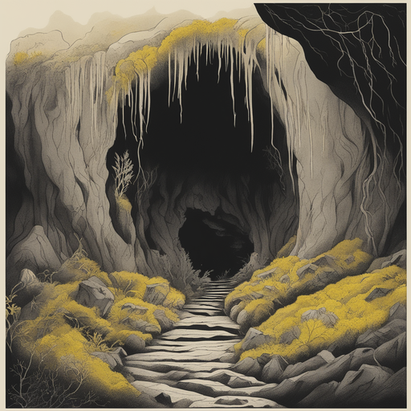
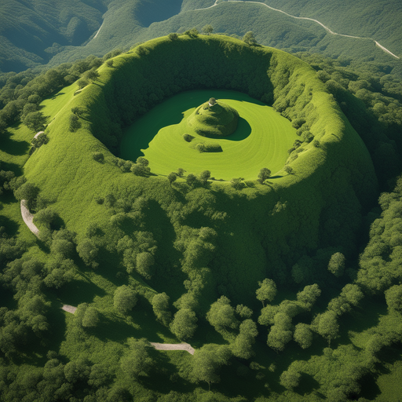

# Terramaestra

Tags: Creatura

# Terramaestra

---

Informazioni Generali

Dimensione: sconosciuta

Tipo: Creatura senziente

Velocità di movimento: 0

Habitat: Foresta dei Giganti

Alleati:

Nemesi:

## 1. Descrizione Generale

---

Terramaestra è una meraviglia naturale dalle caratteristiche uniche e affascinanti. Apparentemente, sembra una collina ordinaria, ma nasconde un segreto profondo sotto la sua superficie.

Le terremaestre sono lontanamente imparentate ai draghi, alla stregua di wyrm e viverne.

## 2. Anatomia

---

Terramaestra è composta da strati di terra, roccia e vegetazione, con radici che si intrecciano in un intricato sistema sotterraneo. La sua parte esterna è ricoperta di erba lussureggiante, arbusti e alberi che si aggrappano alle sue pendici. L'interno di Terramaestra è scavato da una rete complessa di caverne e camere, illuminate da fessi e crepe nella roccia che consentono il passaggio della luce naturale.

## 2. Distribuzione e Habitat

---

La distribuzione esatta di Terramaestra rimane un mistero, poiché non è noto quanti esemplari ne esistano. L'unico esemplare conosciuto si trova nella parte esterna della Foresta dei Giganti, ma è plausibile che ce ne siano altri nascosti in luoghi remoti e inesplorati del mondo. Queste colline potrebbero esistere in vari ambienti, ciascuna unica nel suo genere.

## 3. Comportamento

---

Il comportamento di Terramaestra è altrettanto enigmatico. Sebbene sembri immobile da un punto di vista esterno, il suo ambiente interno è in costante evoluzione. La vegetazione che cresce al suo esterno è rigogliante, con alberi che si sviluppano vigorosamente. All'interno, piante e alberi prosperano grazie a una sorgente d'acqua cristallina che scorre lungo le pareti.

Ciò che sorprende gli esploratori è la sensazione che Terramaestra "respiri". Questo movimento sottostante è testimone di un ecosistema in continua crescita e cambiamento. Terramaestra sembra adattarsi alle condizioni circostanti in modi misteriosi e sconosciuti.

Inoltre, nonostante la sua immobilità apparente, ci sono resoconti di rumori provenienti dalle profondità della collina, suggerendo che potrebbero esistere creature sconosciute che si nascondono al suo interno.

Terramaestra rimane un enigma senza risposta, una meraviglia naturale che continua a sfidare la comprensione umana. I curiosi e gli avventurieri sono invitati a scoprire i suoi segreti, se osano adentrarsi nelle sue profondità sotterranee.

## 4. Interazioni con gli Umani **nelle Antiche Leggende**

---

Nelle antiche leggende dei villaggi che costeggiano la Foresta dei Giganti, Terramaestra è una figura enigmatica e rispettata. Gli umani hanno tramandato racconti di incontri con questa collina vivente, descrivendola come un'entità misteriosa e potente.

### 4.1 Protettrice Nascosta

---

Secondo le leggende, Terramaestra è stata vista come una sorta di protettrice nascosta della regione. Si racconta di eventi in cui la collina sembrava rispondere alle preghiere dei villaggi circostanti, offrendo rifugio o aiuto in momenti di bisogno. Le pietre e le gemme che emergono dal suo interno sono state considerate doni preziosi e talismani portafortuna.

### 4.2 Messaggera della Terra

---

Terramaestra è anche stata vista come una messaggera della terra stessa. Le leggende narrano che gli antichi druidi cercavano la sua saggezza, credendo che avesse una profonda comprensione delle forze naturali e dei segreti del sottosuolo. Si diceva che coloro che cercavano il consiglio di Terramaestra ottenessero visioni e intuizioni profonde sulla natura e sulla vita stessa.

### 4.3 Cura e Tradizioni

---

Nel corso dei secoli, gli abitanti dei villaggi circostanti hanno sviluppato antiche tradizioni per prendersi cura di Terramaestra. Si credeva che realizzare oggetti magici e condurre cerimonie sacre potesse garantire la sua sopravvivenza e il suo favore. Tuttavia, con il passare del tempo, il significato originale di queste tradizioni è andato perduto, trasformandosi in folklore e rituali senza un preciso scopo.

Le leggende di Terramaestra continuano a essere tramandate di generazione in generazione, alimentando il rispetto e la venerazione per questa meraviglia naturale. Gli umani che vivono vicino alla Foresta dei Giganti considerano Terramaestra non solo una parte della loro storia, ma anche un mistero che continua a svelare segreti e a influenzare le loro vite in modi imprevedibili.

## 5. Individui noti

---

L’unico esemplare oggi noto si trova nei pressi di Katane, a sud della [Foresta dei Giganti](Foresta%20dei%20Giganti%2003a15f8accd74ec0a08db3f3c9a26b2b.md).

## 6. Coinvolgimenti in eventi recenti

---

