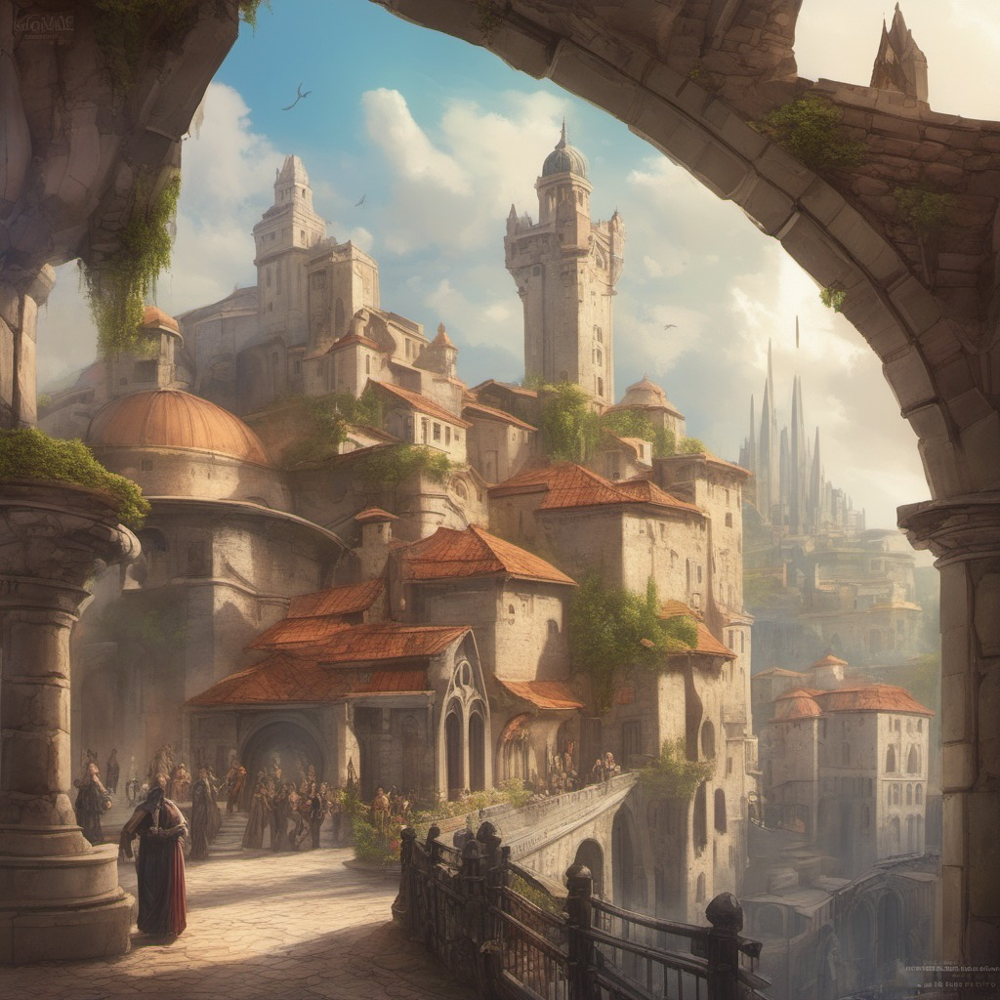
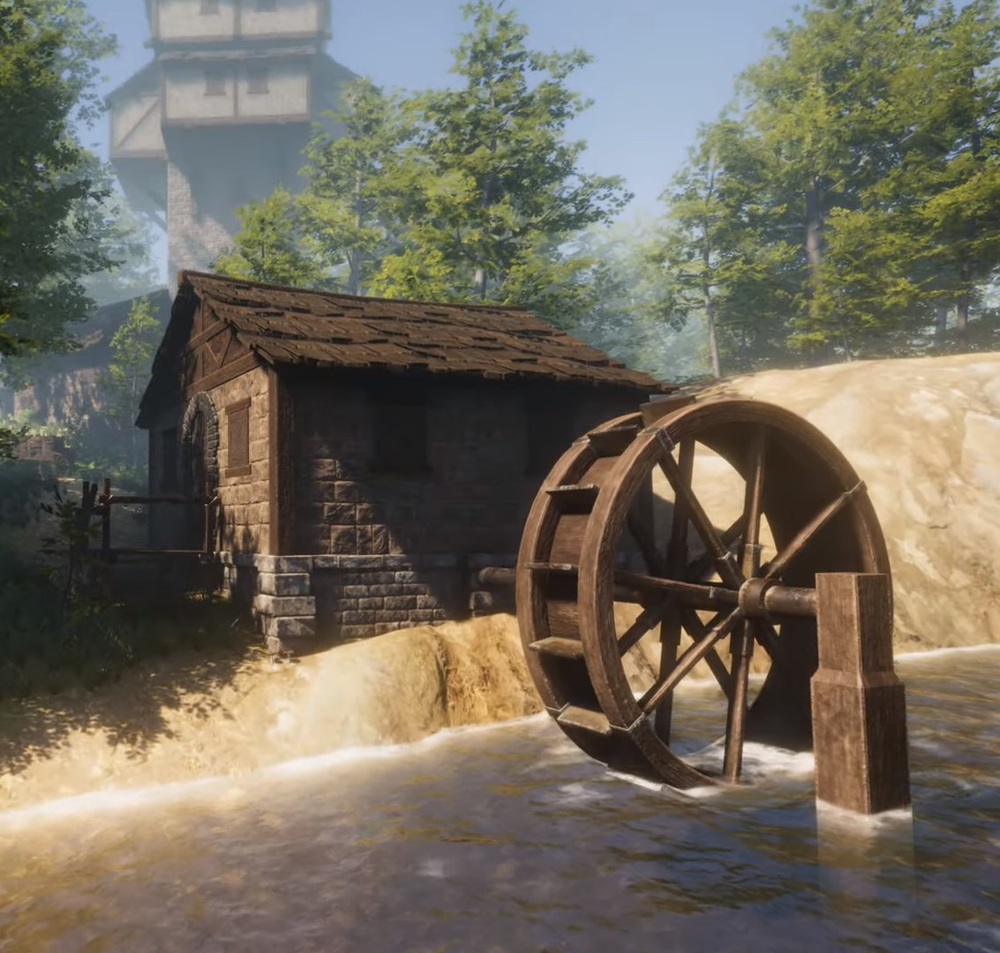

# Valtorria

Tags: Città
Creatore: Davide, Lorenzo
Ispirazione: Salerno

# Valtorria

---

Informazioni Generali

Tipo di Luogo: Città

Dimensioni:

Altitudine: 53m slm

Popolazione: 23000

Paese: Valtara

Luogo:

Alleata con: Cac Hanzaro

Attività: Cantiere navale

---

## 1. Descrizione Generale

---

Valtorria è una affascinante e leggendaria città fantasy situata sulle coste della regione di Valtara. La sua ricca storia risale a un'epoca passata in cui fungeva da capitale di un potente impero che regnava su tutta la regione di Valtara. Col passare del tempo, il suo legato è rimasto vivo e, ancora oggi, è un tesoro prezioso di Valtara, rinomato per le sue splendide luminarie.

## 2. Storia

---

Nell'antichità, Valtorria era il cuore di un potente impero, abbracciando una cultura vibrante e una prosperità fiorente. Il dominio dell'impero si estendeva per l'ampia estensione di Valtara, consolidando la posizione di Valtorria come centro cruciale di arte, commercio e conoscenza. La maestosa architettura della città, caratterizzata da torri imponenti, palazzi intricati e monumenti sontuosi, testimoniava la sua passata grandezza.

Guerre, carestie e lotte intestine minarono la stabilità dell'impero, gettando un'ombra oscura sul suo dominio. Questi turbamenti portarono alla perdita del controllo su molte regioni che un tempo dipendevano da Valtorria, spezzando legami che erano stati forgiati attraverso generazioni. Gradualmente, la città iniziò a sgretolarsi, perdendo il suo prestigio e il suo splendore passati. Le strade una volta affollate si svuotarono, i palazzi magnifici caddero in rovina, e l'antica gloria si dissolse come sabbia nelle mani. Con il passare dei secoli, Valtorria divenne un riflesso sbiadito del suo antico sé, un simbolo di ciò che era stato e di ciò che poteva ancora diventare.

Nell'epoca attuale, Valtorria si erge come una città indipendente, tuttavia, è influenzata dalle complesse dinamiche politiche che agiscono nella regione, sia da città-stato che da regni circostanti. Alla guida di questa affascinante città si trova il visionario leader Enzosor. La sua dedizione costante è rivolta a riportare Valtorria alla sua antica grandezza, preservando al contempo la sua rilevanza storica e incoraggiando un futuro radioso. Mentre Valtorria si sforza di mantenere la sua indipendenza e di riprendersi la sua gloria perduta, il ruolo di Enzosor si rivela cruciale nel negoziare e mantenere un equilibrio delicato con le forze politiche circostanti. Questa dinamica complessa rende Valtorria un crogiolo di intrecci politici e culturali, una città destinata a brillare nel panorama della regione di Valtara, con il suo patrimonio culturale, la sua maestosità architettonica e la magia intrinseca del Festival delle Luminarie a illuminare il cammino verso un futuro ambizioso.  

## 3. Geografia

---

### 3.1 Caratteristiche Costiere

---

Le coste di Valtorria presentano una morfologia variegata, caratterizzata da ampie distese di sabbia dorata e basse scogliere. Queste scogliere, grazie alla loro struttura, fungono da barriera naturale contro l'erosione costiera, proteggendo il litorale dalle forze dell'oceano. Le spiagge sabbiose offrono un ambiente accogliente per i visitatori e la comunità locale, creando una sinergia tra l'uomo e il mare. La presenza di una zona costiera relativamente bassa è stata un fattore chiave nella crescita della città e nella sua dipendenza dal mare come fonte di risorse, commercio e attività portuali. 

### 3.2 Caratteristiche Montane

---

La peculiare disposizione geografica di Valtorria si manifesta nella vicinanza tra la zona costiera e l'altopiano montuoso, poiché le montagne si ergono a pochi chilometri dalla costa. Questa prossimità tra l'ambiente marino e montano crea una transizione affascinante tra i due paesaggi. Le imponenti montagne, caratterizzate da pendii scoscesi e cime che si innalzano verso il cielo, offrono panorami mozzafiato sulla città e sull'orizzonte marino. Questa stretta contiguità tra mare e montagna crea un microclima unico, influenzando le condizioni meteorologiche locali e arricchendo la biodiversità della regione.

## 4. Demografia

---

La demografia di Valtorria è un affascinante e complesso quadro che riflette il susseguirsi delle ere e degli eventi che hanno segnato la storia della città. Situata nella regione di Valtara, questa città ha subito notevoli mutamenti demografici, plasmando la sua popolazione in modi sorprendenti.

### 4.1 **Popolazione Attuale**

---

Valtorria ospita attualmente una popolazione diversificata, composta principalmente da discendenti dei cittadini che hanno scelto di rimanere fedeli alla città durante i periodi tumultuosi della sua storia. La popolazione attuale è stimata a [numero], rendendo Valtorria una comunità di dimensioni moderate.

### 4.2 **Gruppi Etnici**

---

La città di Valtorria è un melting pot di etnie e culture. Tra i gruppi etnici più rappresentati troviamo [elenco di gruppi etnici], ognuno dei quali contribuisce alla ricchezza culturale della città. Questa diversità etnica è una testimonianza delle influenze che hanno plasmato Valtorria nel corso dei secoli.

### 4.3 **Lingue**

---

La lingua predominante parlata a Valtorria è [lingua predominante], ma a causa della diversificazione etnica, una varietà di lingue minoritarie è diffusa tra le comunità di immigrati.

### 4.4 **Evoluzione Storica**

---

L'evoluzione demografica di Valtorria è stata caratterizzata da cambiamenti significativi. Durante il periodo dell'impero, la città era una folla vivace e cosmopolita, attirando persone da tutte le parti di Valtara. Tuttavia, con la caduta dell'impero e i secoli di instabilità, la popolazione diminuì drasticamente.

Negli anni recenti, Valtorria ha assistito a un modesto incremento demografico, grazie agli sforzi del suo leader, Enzosor, di riportare la città alla sua antica grandezza e attirare nuovi abitanti.

La demografia di Valtorria è una testimonianza della sua storia travagliata e della sua capacità di adattarsi e prosperare nonostante le avversità. La diversità etnica e culturale contribuisce alla ricchezza della vita cittadina, creando una comunità vibrante e aperta al futuro.

## 5. Economia

---

L'economia di Valtorria è un riflesso della sua storia ricca e variegata, con un'evoluzione che ha trasformato la città da un centro economico imperiale a un'entità più autonoma e dinamica. Oggi, Valtorria prospera grazie a un'economia diversificata che abbraccia diversi settori chiave.
Uno degli aspetti più distintivi dell'economia di Valtorria è la presenza dei suoi grandi cantieri navali, che costruiscono navi per una vasta gamma di scopi, tra cui militari, commerciali e privati.

### 5.1 **Commercio e Artigianato**

---

Valtorria è stata storicamente conosciuta per il suo ruolo centrale nel commercio e nell'artigianato. La città, con le sue radici nel passato imperiale, è un importante centro di produzione di beni artigianali di alta qualità. Oggetti artistici, gioielli lavorati a mano e manufatti magici sono alcune delle specialità artigianali di Valtorria. Il commercio di questi prodotti alimenta la città e attrae mercanti e acquirenti da tutto il continente.

### 5.2 **Agricoltura e Alimentazione**

---

Le fertili terre circostanti Valtorria forniscono una varietà di prodotti agricoli di alta qualità. Valtorria è rinomata per la produzione di vini pregiati, prodotti lattiero-caseari e prelibatezze gastronomiche. Il settore alimentare è in costante crescita, con ristoranti, enoteche e mercati che soddisfano i palati dei cittadini e dei visitatori.

### 5.3 **Cantieri Navali di Valtorria**

---

I cantieri navali di Valtorria sono rinomati in tutto il continente per la loro maestria nella costruzione navale. Questi cantieri producono navi di alta qualità, che vengono vendute a nazioni vicine e lontane. La loro specializzazione nella costruzione di navi militari, commerciali e private ha contribuito in modo significativo all'economia della città. Questa industria è stata una fonte di orgoglio per i cittadini di Valtorria, che mantengono una lunga tradizione di maestria nella costruzione navale.

### 5.4 **Commercio Marittimo**

---

L'industria navale di Valtorria ha stimolato anche lo sviluppo del commercio marittimo. Le navi costruite nei cantieri di Valtorria solcano gli oceani, portando merci preziose e stimolando lo scambio commerciale tra la città e le altre regioni. Il porto di Valtorria è diventato un'importante via di collegamento per il commercio marittimo e una risorsa economica vitale per la città.

### 5.5 **Tecnologia e Innovazione**

---

I cantieri navali di Valtorria non solo costruiscono navi di alta qualità, ma sono anche un centro di innovazione tecnologica. Gli artigiani locali lavorano costantemente per migliorare la progettazione e la tecnologia navale, rimanendo all'avanguardia nel settore. Questa continua ricerca di eccellenza ha contribuito a mantenere la reputazione di Valtorria come un centro di eccellenza nella costruzione navale.

### 5.6 **Arte e Cultura**

---

L'arte e la cultura giocano un ruolo cruciale nell'economia di Valtorria. La città attrae artisti, musicisti, e scrittori, alimentando un'industria culturale in espansione. Le opere d'arte, le esibizioni teatrali e i festival culturali contribuiscono all'economia locale e all'attrattiva turistica.

### 5.7 **Turismo**

---

Valtorria è una meta turistica di grande successo, grazie alla sua storia affascinante, alla magnifica architettura e ai festival culturali. Il turismo gioca un ruolo essenziale nell'economia della città, con alberghi, ristoranti, e attività turistiche che offrono servizi di alta qualità ai visitatori.

## 6. Cultura

---

### 6.1 **Festival delle Luminarie**

---

Il Festival delle Luminarie è una delle tradizioni più celebrate di Valtorria, una magnifica celebrazione annuale che richiama visitatori da ogni angolo della regione di Valtara. Durante questo incantevole spettacolo, la città si veste di una straordinaria esposizione di decorazioni luminose. Innumerevoli lanterne intricate, che emanano un bagliore etereo, adornano le strade e gli edifici, trasformando il cielo notturno in un mare di stelle scintillanti. Questo festival non solo simboleggia l'unità della regione, ma è anche un vivido ricordo della gloriosa storia di Valtorria.
Ogni anno, abili artigiani e artisti provenienti da Valtorria e dalle città vicine investono la loro maestria creativa nella realizzazione di queste luminarie, contribuendo a rendere il festival un'esperienza indimenticabile per tutti coloro che vi partecipano. Le luminarie sono opere d'arte luminose, frutto di dedizione e passione, e catturano l'immaginazione di tutti coloro che le ammirano, trasportandoli in un mondo di magia e meraviglia.
Il Festival delle Luminarie è un evento atteso con trepidazione da parte di ogni abitante di Valtorria e un'opportunità per celebrare l'orgoglio e l'identità culturale della città. Oltre a essere un'attrazione per i visitatori, il festival rafforza anche i legami tra le diverse comunità della regione di Valtara, unendole in un'atmosfera di gioia e festeggiamenti.
Le luci brillanti e le splendide forme delle luminarie trasformano Valtorria in un regno di incanto, catturando i cuori di coloro che si immergono in questa festa magica. Il Festival delle Luminarie è un omaggio alla grandezza passata di Valtorria e un segno luminoso di speranza per il suo futuro radioso. Ogni anno, mentre le lanterne si accendono e il cielo si illumina, Valtorria risplende ancora una volta nel suo antico splendore, invitando tutti a unirsi a questa celebrazione straordinaria.

## 7. Governo

---

Valtara è governata da un sistema politico unico con caratteristiche di oligogerontocrazia. Il Sindaco, scelto da un collegio di anziani saggi, è il capo della città e dell'esercito, e viene eletto ogni sette anni attraverso elezioni democratiche. La sua leadership militare garantisce la sicurezza della città. Le autorità religiose del Tempio dell'Equilibrio hanno un ruolo influente, guidando le decisioni etiche e morali. Questa forma di governo riflette un equilibrio tra leadership, sicurezza e spiritualità, contribuendo al benessere e alla stabilità di Valtara, una prospera metropoli con una ricca diversità culturale. 

### 7.1 Consiglio degli Anziani e Consiglio dei Rappresentanti

---

Il Consiglio di Valtara è composto da un gruppo selezionato di anziani saggi, noti come "Collegio degli Anziani". Questi membri sono scelti per la loro saggezza, esperienza e competenza in diversi campi, tra cui politica, giurisprudenza, economia e cultura. Il loro ruolo principale è quello di fungere da consiglieri del Sindaco e di contribuire alla formulazione delle politiche e delle decisioni che riguardano la città.
Il Consiglio dei Rappresentanti è invece l'organo legislativo di Valtara, composto da membri eletti direttamente dalla popolazione attraverso elezioni democratiche. Questi rappresentanti hanno il compito di rappresentare gli interessi e le esigenze della comunità e di proporre e approvare leggi e politiche che influenzano la vita di Valtara.
Il Consiglio è un organo consultivo che gioca un ruolo cruciale nel governo di Valtara, fornendo una vasta gamma di competenze e prospettive per guidare la città verso un futuro prospero e armonioso. La sinergia tra il Collegio degli Anziani e il Consiglio dei Rappresentanti assicura un governo equilibrato, inclusivo e rappresentativo, con una governance partecipativa che tiene conto delle esigenze e delle aspettative della popolazione di Valtara.

## 8. Persone famose

---

- [Enzhosor Ent Ino](Enzhosor%20Ent%20Ino%20d098e258d48c4aaea0dccbf531c4688c.md)