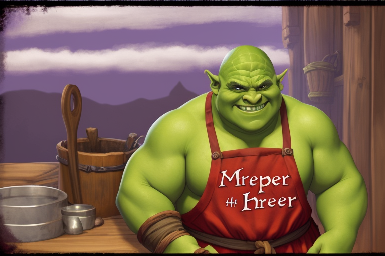
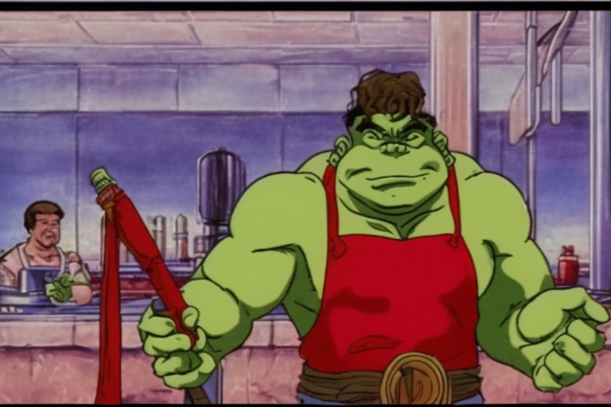

# Victor Hamburger

Tags: NPC
Creatore: Lorenzo
Luogo: Goldendoor

# [Nome]

---

Informazioni Generali

Età: 40

Data di nascita: 1984

Luogo di nascita: Forregard

Razza: Orco

Classe: Guerriero

Alleati: Leona, Hakram

Nemesi:

Alias:

Professione: Locandiere

---

## 1. Descrizione Generale

---

Victor è il gestore della locanda dell’Orco Ubriaco. È un orco con una stazza imponente e un volto segnato dall'età e dall'esperienza. Ha la pelle verde e un paio di occhi profondi e penetranti. Sono anni che dedica l’anima e il cuore a gestire l'Orco Ubriaco, rendendolo un punto di riferimento per il quartiere.

> *Se paghi, mangi. Se non paghi, mangi e lavi i piatti!*
> 

## 2. Biografia

---

La storia di Victor è legata all'Orco Ubriaco, la locanda che gestisce da molti anni. Originario della Nortandria, regione del Nord Valtara, ha ereditato l'attività da un lontano zio, e ha deciso di abbandonare la carriera militare per dedicarsi alla cucina. Nonostante la sua possenza fisica (ama allenarsi) possa intimorire a prima vista, Victor è noto per la sua gentilezza e la sua disponibilità verso coloro che si ritrovano nella sua locanda.

## 3. Carriera

---

In giovinezza ha prestato servizio come militare in diverse città Valtaresi, ma da quando è diventato il proprietario della locanda, Victor ha dedicato anima e cuore alla gestione dell'Orco Ubriaco. La locanda è diventata un punto di ritrovo per avventurieri, mercanti e viaggiatori, ma anche per ladri, furfanti e guardie cittadine. Il suo approccio caloroso e accogliente ha contribuito al successo duraturo del locale, diventato un rifugio unico all’interno della splendende e decadente città di Goldendoor.

### 3.1 La Locanda dell’Orco Ubriaco

 Le porte della locanda si aprono a chiunque ne batta il battente, indipendentemente da provenienza o status. Dentro quelle mura, ogni rigido confine sociale si dissolve, e la locanda diventa un teatro dove le maschere del mondo esterno vengono gettate via.

Il sorriso di Victor accoglie chiunque: re o straccione, mercante o ladro, tutti sono ospiti graditi, purché possano pagare (o lavare i piatti).

All'interno di questa tana di contraddizioni, gli avventurieri narrano storie sotto la luce fioca delle candele, i mercanti contrattano sotto lo sguardo vigile di Victor, e i viaggiatori trovano rifugio nei loro pensieri. Nel contempo, ladri e ricercati trovano un po di calma, e le guardie cittadine abbandonano il peso delle leggi e dei doveri, immergendosi nella folla come semplici avventori.

L'Orco Ubriaco è più di una locanda; è un crocevia di storie, un porto sicuro per gli esuli della società e un rifugio per coloro che cercano un attimo di tregua dai rigidi ruoli della vita. Nell'oscurità di questa taverna, Victor preserva un'armonia fragile, dove le leggi non scritte sono tanto importanti quanto il banchetto che si svolge sotto il suo tetto.

## 4. Personalità

---

Victor è un individuo affabile e aperto. Nonostante la sua stazza, è noto per la sua gentilezza e disponibilità. È un ascoltatore attento e spesso si trova ad essere un confidente per i suoi clienti. Ha un profondo senso di lealtà nei confronti della clientela, che considera come una famiglia allargata.
Negli ultimi tempi, Victor è stato coinvolto in un segreto che coinvolge la principessa Leona e il suo amato Hakram. Ha fornito loro rifugio all'Orco Ubriaco, coprendo le loro azioni e proteggendo il loro segreto. La sua determinazione nel sostenere la fuga di Leona è stata motivata dalla sua compassione e dal desiderio di aiutare coloro che cercano di sfidare le convenzioni e seguire il proprio cuore: se Victor non avesse seguito il suo cuore, a quest’ora sarebbe ancora un triste militare, e sarebbe morto da triste militare, proprio come suo padre!

## A. Coinvolgimenti in Eventi Recenti

---

[Untitled Database](Untitled%20Database%209d3373b6ca9142f882c6d111e68562cb.csv)

## B. Aggiornamenti

---

