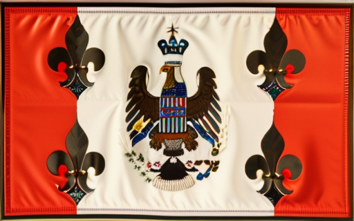
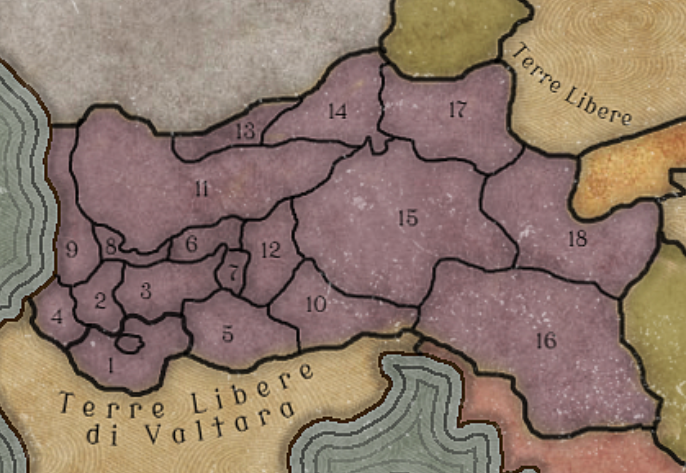

# Disharta

Tags: Stato
Creatore: Lorenzo

# Disharta

---

Informazioni Generali

Nome Ufficiale: Impero di Disharta

Lingue Ufficiali: Dishartiano, Valtarese

Capitale: Goldendoor

Forma di Governo: Monarchia Assoluta

Popolazione: 

Superficie: 

Continente: 

Alleati: Gilda dei Commercianti del NordOvest

---

## 1. Descrizione Generale

---

L'Impero di Disharta è un vasto e diversificato impero che si estende su un territorio immenso, abbracciando una serie di regioni geograficamente e culturalmente eterogenee. Nella regione Sud-Occidentale dell'impero sorge la maestosa capitale, Goldendoor, il cui sfavillante splendore è in netto contrasto con le regioni periferiche più remote. L'Impero è caratterizzato da una profonda divisione sociale e culturale, con le diverse comunità che coesistono in un equilibrio teso.

## 2. Storia

---

L'Impero di Disharta ha una storia intrisa di conquiste militari e dominazione. È nato dalla crescita dell'influenza di Goldendoor, che ha gradualmente esteso il proprio dominio su terre lontane. Queste conquiste hanno spesso incontrato resistenza da parte delle popolazioni locali, molte delle quali sono ancora riluttanti a sottomettersi al potere imperiale. Questa storia di conquista e dominio ha lasciato cicatrici profonde nelle regioni periferiche, alimentando tensioni e rivendicazioni separatiste.

## 3. Geografia

---

L'Impero di Disharta è caratterizzato da una vasta e variegata geografia. Comprende regioni costiere, catene montuose, vaste pianure e zone desertiche. Le differenze geografiche si riflettono nelle diverse economie regionali e nelle culture locali. La capitale, Goldendoor, sorge su una fertile pianura ed è il centro politico ed economico dell'Impero.
Il territorio dell’Impero è diviso amministrativamente in 18 province e 1 distretto:

- Distretto di Goldendoor
1. Provincia di Maridona
2. Provincia di Cedrelia
3. Provincia di Valerantha
4. Provincia di Thessamar
5. Provincia di Fagot
6. Provincia di Lyriandor
7. Provincia di Silvershore
8. Provincia di Ironspire
9. Provincia di Eldergrove
10. Provincia del Mitegard Nord-Orientale
11. Provincia di Frostholme
12. Provincia di Stormwatch
13. Provincia di Emberhold
14. Provincia di Stonehaven
15. Provincia di Sunreach
16. Provincia di Windmere
17. Provincia di Shadowfen
18. Provincia di Ebonhurst

## 4. Demografia

---

L'Impero ospita una popolazione diversificata, con una vasta gamma di gruppi etnici, lingue e tradizioni culturali. Le principali popolazioni vivono principalmente nelle regioni costiere e nelle pianure Sud-Occidentali, mentre le regioni periferiche sono abitate da gruppi più isolati e spesso marginalizzati. Questa diversità demografica è una delle sfide principali nell'amministrazione e nel mantenimento dell'unità imperiale.

## 5. Economia

---

L'economia dell'Impero di Disharta è altamente diversificata. Le regioni costiere sono caratterizzate dal commercio marittimo e dalla pesca, mentre le regioni centrali si concentrano sull'agricoltura e l'allevamento. Tuttavia, la disuguaglianza economica è una caratteristica distintiva dell'Impero, con le regioni più remote spesso trascurate e impoverite.

## 6. Cultura

---

La cultura dell'Impero di Disharta è eclettica e multiforme, con una ricca varietà di lingue, religioni, tradizioni culinarie e pratiche culturali. Questa diversità culturale è spesso una fonte di orgoglio per molte comunità, ma può anche portare a tensioni e conflitti: la cultura dominante della capitale è la sua lingua sono imposte come obbligatorie in tutto l’impero, venendo spesso viste come estranee, e spesso rifiutate nelle regioni più periferiche. La cultura imperiale è di origine valtariana:  il distretto di Goldendoor e le 3 provincie di Maridonia, di Fagot e del Mitegard Nord-Orientale fanno parte della regione storica del Mitegard, o Mitegard Settentrionale, per distinguerlo dai territori del Mitegard Meridionale facente parte delle Terre Libere valtariane. La lingua Dishartiana ha un alto grado di intelligibilità con il Comune Valtarese.

## 7. Governo

---

L'Impero è una monarchia assoluta, con l'Imperatore al vertice del potere. L'attuale sovrano è Lucius III, ma il potere centrale è spesso contestato dalle diverse regioni dell'Impero. Le questioni di autonomia regionale, lingua e identità culturale sono spesso soppresse dal governo centrale. Mantenere l'unità imperiale è una delle sfide più grandi per l’impero, soprattutto negli ultimi decenni, caratterizzati da forti contrasti.