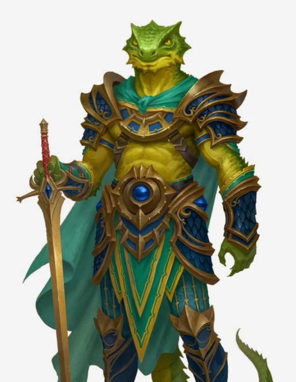

# Verde Windrider

Tags: NPC
Creatore: Lorenzo

# Verde Windrider

---

Informazioni Generali

Età: 45 

Anno di nascita: 1978

Paese di nascita: ?

Razza: Lizardfolk

Relazioni: Paladino di San Francesco, Comandante Generale della Gilda dei Protettori di Kos

Alleati: Ordine dei Paladini di San Francesco; Gilda dei Protettori della Sila devoti a San Francesco e ai Lupi

Nemesi: Setta del Sangue

Possedimenti importanti:

---

## 1. Descrizione Generale

---

Verde è un Lizard Folk dalla pelle squamosa di colore verde brillante, che rispecchia il suo nome. Le sue scaglie sono resistenti e riflettono la luce del sole in modo affascinante. Con un'altezza leggermente superiore alla media per la sua razza, Verde emana un'aria di forza e determinazione. La sua armatura da paladino, abbellita con simboli sacri a San Francesco, brilla con luce propria, riflettendo la sua devozione alla causa della giustizia.

> "Custodire la luce della giustizia è un impegno che non conosce sosta, un dovere che abbraccio con ogni scaglia del mio essere. Che il mio nome sia ricordato come un protettore dei deboli e un difensore della verità.”
> 

## 2. Biografia

---

Durante una delle sue missioni, Sam, un paladino di San Francesco, trovò un neonato di Lizard Folk abbandonato e in pericolo. Mosso a compassione, decise di portarlo con sé e di allevarlo insieme a suo figlio come se fossero fratelli. Gli diede il nome di Verde, a causa delle sue scaglie di colore verde brillante.
Verde crebbe forte e sano sotto la cura del paladino, sviluppando un forte legame con suo fratello adottivo Hart, che considerava il suo amico più intimo.
Con il passare degli anni, Sam addestrò entrambi i ragazzi alla vita di paladini. Essi impararono le arti della guerra, ma anche l'importanza dell'empatia e della compassione. Sam li istruì sulla natura degli spiriti elementali, sull'importanza della preghiera e del rispetto della vita di ogni essere vivente.
Verde e Hart dimostrarono di essere molto talentuosi e determinati, e quando il loro addestramento fu completato, giurarono fedeltà a San Francesco come paladini, seguendo le orme del padre e promettendo di servire la sua causa.
Verde era grato a Sam per avergli dato una famiglia e per avergli insegnato il significato della giustizia e dell'onore. Il suo addestramento lo rese un paladino valoroso e determinato, ma l’amicizia con Hart lo rendeva anche più umano e compassionevole.
Verde e suo fratello giurarono lo stesso mese del Giorno del Sangue, momento più buio della storia dell’Ordine, in cui molti nobili paladini, compreso Hart, persero la vita a causa del tradimento dei loro compagni.

## 3. Carriera

---

Verde ha dedicato gran parte della sua vita all'addestramento e alla carriera di paladino. Dopo aver giurato fedeltà a San Francesco, combatté con onore al fianco di suo padre Sam e dei paladini rimasti nella la guerra del sangue. La sua tenacia e il suo coraggio contribuirono alla vittoria dei paladini, vendicando la morte di suo fratello adottivo Hart.

Dopo la guerra, Verde non si fermò. Insieme a un gruppo di paladini, fondò la [**Gilda dei protettori della Sila Devoti a San Francesco e ai Lupi**](Gilda%20dei%20protettori%20della%20Sila%20Devoti%20a%20San%20Franc%20e29bb7909af24fee931336355db913d4.md) , un'organizzazione dedicata alla difesa dei deboli e alla promozione della giustizia in tutto il mondo. Verde fu uno dei membri fondatori e fece parte del primo Consiglio Supremo, noto come il Consiglio dei Fondatori, che definì le basi della gilda.

Oggi, Verde è il Comandante Generale della sede della Gilda dei Protettori a Kos, una posizione di grande responsabilità che lo vede guidare la difesa della città e coordinare gli sforzi dei Protettori in tutta la regione.

## 4. Personalità

---

Verde è noto per la sua natura compassionevole e la sua lealtà assoluta ai principi di giustizia di San Francesco. Ha ereditato l'empatia e la gentilezza di suo padre adottivo Sam, ma possiede anche la fermezza e la determinazione di un paladino. È un individuo risoluto, sempre disposto a proteggere gli indifesi e a combattere per ciò in cui crede.

La perdita di suo fratello adottivo Hart durante il Giorno del Sangue lo ha spinto a impegnarsi ancora di più nella lotta contro le forze del male. La sua personalità riflette una mescolanza di calma e determinazione, rendendolo un comandante rispettato dai suoi uomini e un paladino ammirato da coloro che protegge.

## A. Coinvolgimenti in eventi recenti

---

[Untitled Database](Untitled%20Database%2017d2e2b7db1d496f86b6dc2194d49887.csv)

## B. Aggiornamenti

---

