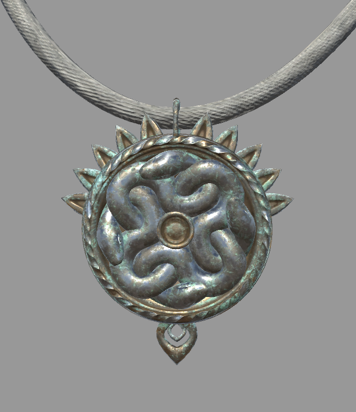
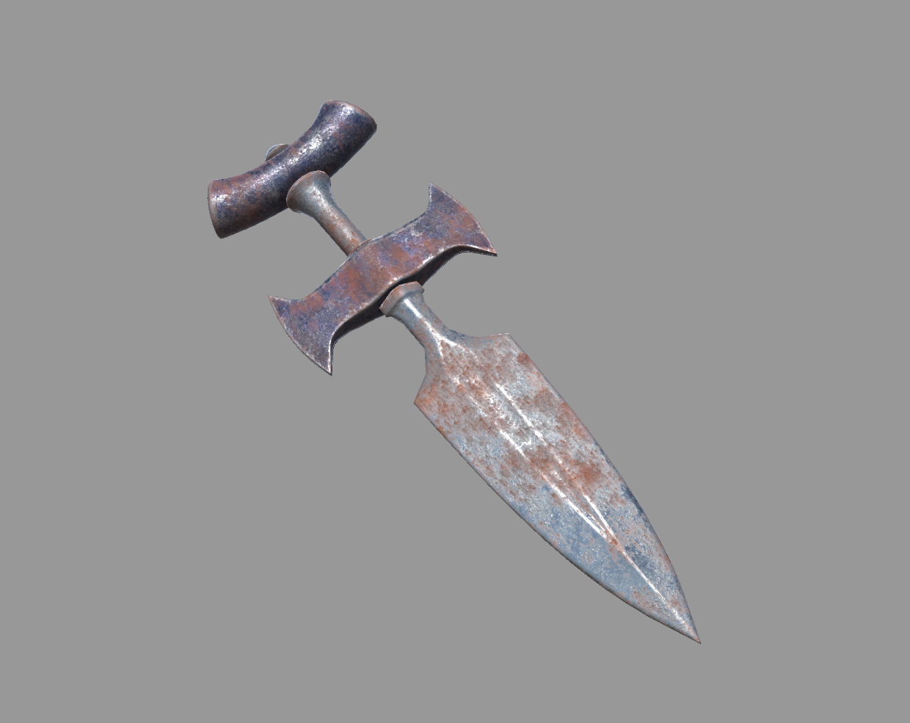

# [TEMPLATE ARTEFATTO]

# [Nome Artefatto]

---

Informazioni Generali

Tipo: [e.g. Amulet]

Luogo d’Origine:

Storia:

Usato da: [Character/Organization]

Usato in: [Historical event]

Attuale Possessore:

Possessori Passati:

---

---

## 1. Descrizione Generale

---

The [artifact] is made out of [material]. 

> Quote about [artifact]
> 

## 2. Storia

---

[Artifact] was found in the [location]. Soon after it was transported to [another location] and there was studied by [character].

## 3. Predecessori e Origini

---

## 4. Variazioni

---

## 5. Player/Reader Predispositions & Archetypes:

---